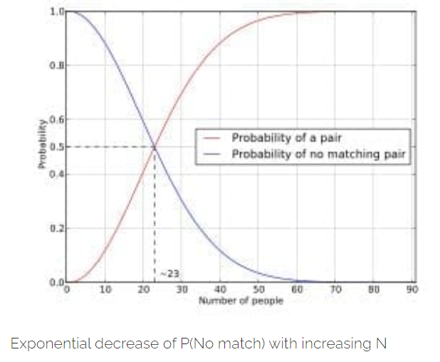

### Coincidence Statistics - A Non-Formal Approach to Probability!

As Maxwell puts it straight : "*The true logic of this world is in the calculus of probabilities*".  

When we talk literature, we mean literature only. No need to bring up bookish terms to define probability! To put this in a simpler way, think of the following scenario :

Suppose some dark night a policeman walks down a street, apparently deserted; but suddenly he hears a burglar alarm, looks across the street, and sees a jewellery store with a broken window. Then a gentleman wearing a mask comes crawling out through the broken window, carrying a bag which turns out to be full of expensive jewellery. The policeman doesn’t hesitate at all in deciding that this
gentleman is dishonest. But by what reasoning process does he arrive at this conclusion? 

Ok, now you get it, right??  Probability is the science of this intuition or in more stricter terms deductive and plausible reasoning.

### Time to get formal now, how can we measure probability??

It was as late as the 16th and the 17th centuries that scientists could actually realize that chance (probability) can be measured.The Greeks even had a goddess of chance, **Tyche**. Several contemporary philosophers tried to give an empirical measurement of chance, but it appears that there was no quantitative theory of chance in these times.

Consider the analogous problem for another metric, say length. How would you measure length? Of course, it is silly to ask this question now, but this was a valid problem in the 16th century.

**You find a standard of equal length, apply it repeatedly and count**. The standard might be your foot,as you pace off a distance. One such approach was made in 1522, etched eternally in history books, known as the **"lawful rood"**.

The idea was to line up the feet of 16 people as they emerged from the church,as shown in the figure below :

The various folks have different foot lengths, but an implicit averaging effect was accepted by a group, even though the explicit term "average" was non-existent at that time.

However, there is an objection. There is a kind of circularity involved in the process. We are defining length, but we are already assuming that our standard remains the same length as we step off the distance.

Eventually, we refine our notion of length.Your foot may change length;so may the rod; so may the standard meter stick, at a fine enough precision.We refine the measurement of length using physics.The circularity is real, but it indicates a path for refinement rather than a fatal objection.

The same thing happens with probability. To measure probability, we first find or make **equally probable** cases and then count them.

We speak of probability only for observations that we contemplate being made in the future. By the “probability” of a particular outcome of an observation we mean our estimate for the most likely fraction of a number of repeated observations that will yield that particular outcome. If we imagine repeating an observation—such as looking at a freshly tossed coin — **N** times, and if we call  our estimate of the most likely number of our observations that will give some specified result A, say the result “heads,” then by , the probability of observing A, we mean .

First of all, we may speak of a probability of something happening only if the occurrence is a possible outcome of some repeatable observation.

We should emphasize that **N** and   are not intended to represent numbers based on actual observations.   is our best estimate of what would occur in **N**  imagined observations. Probability depends, therefore, on our knowledge and on our ability to make estimates. In effect, on our common sense! Fortunately, there is a certain amount of agreement in the common sense of many things, so that different people will make the same estimate. Probabilities need not, however, be **“absolute”** numbers. Since they depend on our ignorance, they may become different if our knowledge changes.

### The Birthday Paradox

Reiterating **Diaconis'** words, *coincidences occur to all of us*. The birthday paradox has emerged as a useful tool to enable standards of surprise.

> *In a room of just 23 people, do you know there’s a 50-50 chance of at least two people having the same birthday?*

This amazingly counter-intuitive result is actually called a paradox because our brain hates processing compounding exponents.We expect probabilities to be linear and only consider the scenarios we are involved in.

Let's investigate the case for **N** people and **C** categories.(We consider days as categories here, i.e. *C = 365*).

We make a few assumptions before tackling this. First of all we assume the birth of all individuals to be independent of each other(i.e. we drop the cases of twins) and for simplicity, we assume a non-leap year, which means we only deal with 365 days.

So, we basically have **N** people, each independently and uniformly distributed in **{1,2,..,C}**.

Now, if **N = C+1**, is there a chance that all these numbers are distinct? Of course not . (Simply by the **Pigeon Hole Principle**)

Call the chance of all these numbers being distinct as **P(C,N)**.

So, see that, .

For a simpler approximation, for, , the chance of success is close to .

The basis of this approximation is rooted in this proposition that when **N** and **C** are large and  is small, the chance of no match is **P(C,N)** ~ .

So, guess what if **N = 75** and **C = 365**?

Voila! there’s almost a 99.9% chance of at least two people matching.

The Birthday paradox has turned tables in cryptography and in a more generic sense applies to hash functions: the expected number of N-bit hashes that can be generated before getting a collision is not , but rather only . This is exploited by [`birthday attacks`](https://en.wikipedia.org/wiki/Birthday_attack) on [`hash functions`](https://en.wikipedia.org/wiki/Hash_function).

### A Dice yet to Roll!

Let's think of an extension to the Birthday Problem. Suppose there are two types of people, say m men and n women. Then find the probability of no shared birthdays between at least one man and one woman.

> A possible hint : You will require [`Stirling Numbers of the second kind`](https://en.wikipedia.org/wiki/Stirling_numbers_of_the_second_kind).

You may also use the Birthday problem to study multiple coincidences. As an example, how large should N be to have approximately even odds of a triple birthday match?

Till then, keep learning, keep thinking and keep innovating!

### References

> *Great Ideas About Chance - Persi Diaconis, Brian Skyrms*

> *Feynman's Lectures on Probability*

> *Mathematical Recreations and Essays- Ball & Coxeter*

<noscript>Please enable JavaScript to view the <a href="https://disqus.com/?ref_noscript">comments powered by Disqus.</a></noscript>
