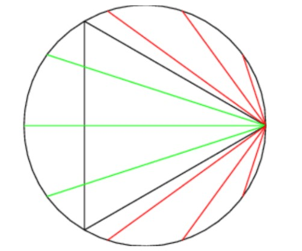
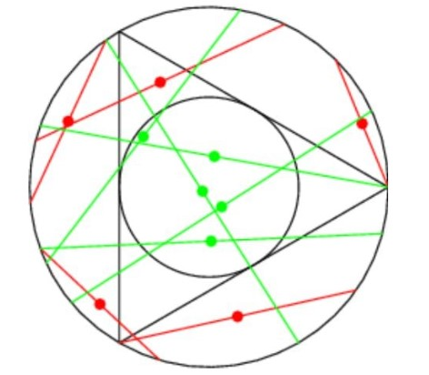

> *"Geometry is not true, it is advantageous."* - **Henri Poincare**

Yes , exactly... it's time to merge the two stalwarts together : *"Geometry"* and *"Probability"*.

### The Probability Measure of Geometrical Elements

In probability theory one is usually concerned with random variables which are quantities, or sets of quantities, taking values in some set of possibilities on which there is defined a non-negative measure, satisfying certain required conditions which enable us to interpret it as a probability. In the theory of geometrical probabilities the random elements are not quantities but geometrical objects such as points, lines and rotations. Since the ascription of a measure to such elements is not quite an obvious procedure, a number of "paradoxes" can be produced by failure to distinguish the reference set. These are all based on a simple confusion of ideas but may be useful in illustrating the way in which geometric probabilities should be defined.

### Bertrand's Paradox

We consider one paradox due to **J.Bertrand (1907)**.

The problem of interest is precisely : 

> *Determine the probability that a random chord of a circle of unit radius has a length greater than the square root of 3, the side of an inscribed equilateral triangle*.

### Context of the Problem

The development of the Theory of Probability has not been smooth at all. The first attempts to formalize the calculus of probability were due to **Marquis De Laplace** (1749-1827) who proposed to define the probability \\(\mathbb{P}(A)\\) of an outcome A as the ratio of the number of events that result in the outcome A to the total number of possible events. This is of course only meaningful if the number of all possible events is finite and, in addition, all the events are equi-probable. The notion which Laplace has also defined. However, in our first blog post, we addressed the fact that the definition is, in a sense, circular - a notion of equi-probable is defined prior to the introduction of probable.

Thus, at the time, the field did not seem to have a sound foundation. Attempts to extend the definition to the case of infinite number of events led to even greater difficulties. The **Bertrand's Paradox** is one such discovery that made mathematicians wary of the whole notion of probability.

Apparently, this problem has more than one solution, meaning as the perspective of the reader changes, the solution also changes! Worthy of a paradox right?!

### Some of the most discussed solutions

What about the probability, when it is \\(\frac{1}{3}\\)?

Yeah, this is correct! Provided your thought process follows the same lines as this proof :

> *Any chord of the circle intersects it in two points, and we may suppose these to be independently distributed in probability distributions which are uniform over the circumference of the circle. Without loss of generality, we can suppose one of the two points to be at a vertex of an inscribed equilateral triangle. There is then just \\(\frac{1}{3}\\) of the circumference in which the other point can lie in order that the resulting chord has length greater than \\(\sqrt{3}\\), so that the probability is \\(\frac{1}{3}\\).*

Do you get what are the favorable areas?

What about \\(\frac{1}{4}\\)?

Umm...sure! why not? Any chord is uniquely defined by the foot of a perpendicular on it from the center. If this point is distributed uniformly over the circle the probability of it lying in any region of area **A** is **A\\(\pi^{-1}\\)** since
the total area of the circle is \\(\pi\\). For the chord to have length greater than \\(\sqrt{3}\\) the foot of the perpendicular must lie inside a circle of radius \\(\frac{1}{2}\\) and hence the probability is \\(\frac{1}{4}\\).

But but.. it is also \\(\frac{1}{2}\\)?

Try to think of a proof why this probability is also \\(\frac{1}{2}\\).

Based on constructing a random chord in a circle, the paradox involves a single mathematical problem with three reasonable but different solutions. It’s less a paradox and more a cautionary tale. It boils down to the same old question: "What do you mean by **random**?"

### Let's hand it over to Buffon

The **"Buffon's Needle Problem"** which many of us encountered in our college days has now been with us for 200 years. One major aspect of its appeal is that its solution has been tied to the value of \\(\pi\\) which can then be estimated by physical or computer simulation today. It is interesting that in the original development, Buffon (1777) extols geometry as a companion tool to the calculus in establishing a science of probability and suggests that chance is amenable to the methods of geometry as well as those of the calculus. Buffon indicates that the human mind, because of prior mathematics, preferred numbers to measures of area but that the invention of games revolving around area and ratios of areas could rectify this. To highlight this point he investigated a game already in practice in the 18th century known as **"clean tile"**.

### Clean Tile Problem

> *In a room tiled or paved with equal tiles, of any shape, a coin is thrown upwards; one of the players bets that after its fall the coin will rest cleanly, i.e., on one tile only; the second bets that the coin will rest on two tiles, i.e., that it will cover one of the cracks which separate them; a third player bets the coin will rest over 3, 4, or 6 cracks: it is required to find the chances for each of these players.*

This problem is regarded as the precursor of the famous **"needle problem"**.

Buffon in his own words states, 
> *"I assume that in a room, the floor of which is merely divided by parallel lines, a stick is thrown upwards and one of the players bets the stick will not intersect any of the parallels on the floor, whereas on the contrary the other one bets the stick will intersect some one of these lines; it is required to find the chances of the two players. It is possible to play this game with a sewing needle or a headless pin."*

### Buffon's Needle

Suppose we have a floor made of parallel strips of wood, each the same width, and we drop a needle onto the floor. What is the probability that the needle will lie across a line between two strips?

### Uspensky's Proof

Let the parallel lines be separated **d** units apart. The length of the needle is given by **l**, with the assumption **l\\(\leq\\)d**. Uspensky (1937) provides a proof that the probability of an intersection is \\(p = \frac{2l}{\pi.d}\\). He develops this by considering a finite number of possible positions for the needle as equally likely outcomes and then treats the limiting case as a representation of the problem. This includes a definition of randomness for the distance **x** of the needle's midpoint to the nearest line and the acute angle \\(\phi\\) if formed by the needle and a perpendicular from the midpoint to the line. The solution is obtained by computing the ratio of favorable outcomes to the total set of outcomes and passing to the limit.

A measure of the set of total outcomes is given by :

$$\int_{0}^{\frac{\pi}{2}}\int_{0}^{\frac{d}{2}}dxd\phi = \frac{\pi.d}{4}$$

From he figure above, it's evident that the measure of the set of intersections is :

$$\int_{0}^{\frac{\pi}{2}}\int_{0}^{\frac{l}{2}cos\phi}dxd\phi = \frac{l}{2}$$

$$\therefore p = \frac{\frac{l}{2}}{\frac{\pi.d}{4}}$$

For knowing about the further generalizations to this problem you must go through [`Laplace's Extension`](https://mathworld.wolfram.com/Buffon-LaplaceNeedleProblem.html) and [`Long Needle case`](https://en.wikipedia.org/wiki/Buffon%27s_needle_problem#Case_2:_Long_needle).

Now, let's explore something new!

### Barycentric Coordinates take guard!

What are barycentric coordinates?

For precise definiton and illustration of barycentres , you can go through Particle Geometry and Triangles.

The barycentric coordinates are generally defined in context of triangles but they can be set up in a more general space \\(\mathbb{R}^n\\). For **n = 1**, it takes 2 distinct points **A** and **B** and two coordinates **u** and **v**. Every point K on the real line is uniquely represented as **K = uA+vB** , where **u + v = 1**. More generally, to define the **barycentric coordinates** in \\(\mathbb{R}^n\\) , one need **n + 1** points that do not lie in a space of lesser dimension.

Now, let's look at a problem :

> Choose **n** points at random on a segment of length 1. What is the probability that an **(n+1)-gon** (a polygon with **(n+1)** sides) can be constructed from the **(n+1)** thus obtained segments? 

This is a generalization of this famous problem : 

> "Two points are selected at random on a straight line segment of length 1. What is the probability that a triangle can be constructed out of thus obtained three segments?"

The above problem has a simple geometric proof and does not require heavy machinery , which will probably be addressed in our future posts. But the generalization makes the problem tempting enough to use barycentres.

First of all for the validity of the **(n+1)-gon**, it must satisfy :

$$x_i < x_0 + x_1 + ... + x_n − x_i = 1 − x_i \forall i = {0,1,...,n}$$

Thus, \\(x_i < \frac{1}{2}\\).

The object obtained by this set of inequalities is is obtained from the basic simplex by removing smaller **simplexes**, one at every vertex. Each of these **(n+1)** smaller simplexes has the **hypervolume** equal to \\({\frac{1}{2}}^n\\) of the hypervolume of the basis simplex.

Thus, the probability that the barycentric co-ordinates satisfy this set of inequalities is \\(p = 1 − \frac{n + 1}{2^n}\\).

See that this probability goes to 1 as **n** grows larger and larger explaining the fact that it is easier to find segments to construct a many sided polygon than it is to find the sides of a triangle, which is rather natural.

### A Dice yet to Roll!

Today's section does not contain any problem, rather I would like to share a popular research problem regarding **"The extension of Buffon's Needle Problem in three dimensions"**. There have been many attempts to incorporate another dimension to the traditional needle problem for instance, If the needle were released in a weightless environment, then it would not drop down to the plane, it would float. This introduces another dimension into the problem. I would suggest some research articles in the bibliography which discusses this problem in detail. You can go through them if this problem excites you enough to dig deep into it.

Till then, stay safe!

Ciao!

### References

>  *"The Buffon Needle Problem Extended" - JAMES MCCARRY & FIROOZ KHOSRAVIYANI*

> *"The Buffon–Laplace needle problem in three dimensions" - Zachary E Dell and Scott V Franklin*

> *"Fifty Challenging Problems in Probability with Solutions" - Mosteller*

> *"Geometric Probability" - Kendall, Morran*

---

We encourage discussions and queries, along with sharing of ideas and concepts, through this *Disqus* server below. Feel free to share and interact! 

---

<noscript>Please enable JavaScript to view the <a href="https://disqus.com/?ref_noscript">comments powered by Disqus.</a></noscript>

