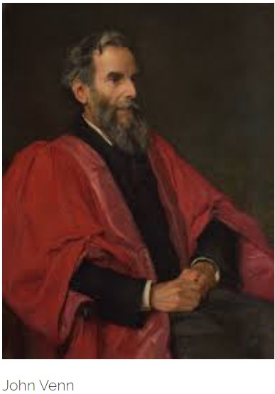
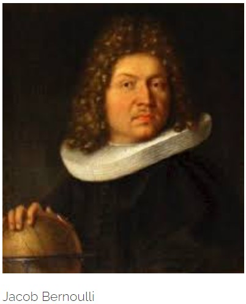

This post discusses about the history of frequentism and how it was an unperturbed concept till the advent of Bayes. It sheds some light on the trending debate of **frequentism** vs **bayesian** thinking.

> *"The probable is that which for the most part happens" - "Rhetoric", Aristotle.*

### Frequentism

Hopefully this example will be able to explicate the true sense of the word:

Suppose, I have misplaced my phone somewhere in my home. I can use the phone locator on the base of the instrument to locate the phone and when I press the phone locator the phone starts beeping.

Now the question is which area of my home should I search?

Apparently, there are two clear approaches to this problem :

#### Approach 1

I can hear the phone beeping. I also have a mental model which helps me identify the area from which the sound is coming. Therefore, upon hearing the beep, I infer the area of my home I must search to locate the phone.

#### Approach 2

I can hear the phone beeping. Now, apart from a mental model which helps me identify the area from which the sound is coming from, I also know the locations where I have misplaced the phone in the past. So, I combine my inferences using the beeps and my prior information about the locations I have misplaced the phone in the past to identify an area I must search to locate the phone.

The first approach, which is probably the trite way out defines **frequentism** or reflects a person's **frequentist** ideas or beliefs.

The second approach surely, as you have guessed already is how a Bayesian thinks.

Now, I am not going into the debate on which approach is better **Frequentist** or **Bayesian**? Being a fan of Bayesian thought processing myself, I hear that many contemporary statisticians feel that the **Bayesians** have lobbied into the limelight with their "crooked" mindset of unnecessarily complicating things. Rather I will like to elucidate **Approach 1**, it's history and the present scenario of **frequentist** statistics.

### A Brief History of Frequentism

The term **'frequentist'** was first used by **M.G. Kendall** in 1949, however the belief had already emerged centuries before. It was a behemoth of a belief which was unquestionably the most dominant in all sciences.

> What is the relation of frequency to probability?

**Bernoulli** (also **Borel**) gave part of an answer in terms of "Laws of Large Numbers".Probabilities of single cases are essential in stating and proving the laws. Venn provided a thorough exposition of his staunch frequentist views in his treatise *"The Logic of Chance: An Essay on the Foundations and Province of the Theory of Probability"*. **Von Mises** postulated kinds of infinite sequences that would typically (with probability 1) be produced by independent and identically distributed trials.

As carefully put by **Diaconis**, frequentism radically restricts the range of probability theory, and it must be judged inadequate as a general account of probability. So, whether Persi Diaconis was a frequentist or not will be left to the reader as an exercise to judge. But a deep question has been uncovered in the deellopment of the frequentist view: *What is the nature of a random sequence?*

Furthermore, *What is the relation of idealization to reality?* In frequentism, it arose because the development of a theory demanded more than actual frequencies in the world.It required limiting relative frequencies in idealized infinite sequences.

There is another question that the frequency view leaves hanging, that is, how probability can be a *guide to life*. To be more precise, how can probability as frequency inform degrees of belief and rational decision?

Venn answers this roughly that as degrees of belief in a single event, we should take the corresponding relative frequency in a series of like events.

So, again we trace back to our earlier question of equi-probable events or likely events. How can we define them without circularity?

### Venn's flawed idealization of "likely" events

Venn claimed that if one's degrees of belief agree with the relative frequencies, then an infinite series of fair bets would have a payoff in the limit that is fair, and that is general, expected value could be identified with limiting average value.

He has no right to claim this. Consider an idealized sequence of coin flips with limiting relative frequency of heads = \\(\frac{1}{2}\\). Any bet at even odds is a fair bet. Consider an idealized agent A who bets on every toss and always loses. You might want to argue that this cannot happen, but there is in fact nothing a frequentist can do to preclude it.

However Venn was modest enough to see holes in his own theory. 

### Bernoulli and the WLLN

**Jacob Bernoulli** was well aware of the limitations of relying on intuitively equi-probable cases. He looked towards frequency evidence to inform probability judgements, as practical men had always done formally.

He proved the first law of large numbers. With arbitrarily high probability, the relative frequency of heads can be made to approximate the probability of heads as closely as you please by choosing a long enough series of trials.

He aimed at a determination of the number of draws with replacement from an urn that would be required for the relative frequencies to be within specified bounds of the chances with a specified high probability. He remarks that if it were a question of frequencies exactly equaling the chances, a long series of trials would just make things worse. At this point, frequencies and chances are clearly treated as two distinct and separate things.

Bernoulli derived (with a tacit assumption of independence) an upper bound on the required number of trials. This was what he called his **golden theorem**. The law of large numbers follows.

Nevertheless, his bound was not very good and conjures up very large numbers of trials. **Ars Conjectandi** presents an instance :

> The chance is \\(\frac{3}{5}\\), the desired interval for the relative frequency is between \\(\frac{29}{50}\\) and \\(\frac{31}{50}\\), and the desired probability that the frequency falls within that interval is \\(\frac{1000}{1001}\\). Bernoulli's bound says that this is achieved if the number of trials is at least 25,550.Datasets of this magnitude were not available at Bernoulli's time.

### Bernoulli's Swindle

Bernoulli was quite into determination of chance from empirical data.He was well convinced that in many areas, it was impossible to determine chances by counting symmetric cases.An idea flashed through his mind that what we are not given to derive *a priori*, we at least can obtain *a posteriori*, that is, we can extract it from repeated observation of the results of similar examples.

The question is, given the data- the number of trials and the relative frequencies of success in those trials- what is the probability that the chances fall within a certain interval? It is evident that this is not the problem which Bernoulli solved.He called this problem the **"inverse problem"**.

here comes the funny part; Bernoulli somehow convinced himself that he had solved the **"inverse problem"**. Well how? It was by a vague argument using the concept of moral certainty. Bernoulli used this term to refer to a probability so close to 1 , that for all intents and purposes, one may treat it as a certainty. He argued that he had shown that with a large enough number of trials, it would be morally certain that relative frequency would be approximately equal to chance. But if frequency equals chance, then chance equals frequency.

What a slipup! Really motivational for those who make silly mistakes ... At least they don't publish them :P.

**Thomas Bayes** solved the **"inverse problem"** and this time there was no cheating.

### Frequentism in recent times

Major contributors to frequentist statistics in the early 20th century included **Fisher**, **Neyman** and **Pearson**. Fisher contributed to most of statistics and made significance testing the core of experimental science; Neyman formulated confidence intervals and contributed heavily to sampling theory; Neyman and Pearson paired in the creation of hypothesis testing. All valued objectivity, so the best interpretation of probability available to them was frequentist. 

Fisher said,
> *"...the theory of inverse probability is founded upon an error, and must be wholly rejected." (from his Statistical Methods for Research Workers).*

While Neyman was a pure frequentist, Fisher's views of probability were unique; Both had nuanced view of probability.

### Lindley's Paradox

This is a major checkpoint in statistical history where the frequentists started to doubt themselves.

**Lindley’s paradox** is in fact a difficulty reconciling two paradigms — Bayesian and frequentist statistics. There is no mathematical inconsistency.

Let's look at an example : In a certain city 49,581 boys and 48,870 girls have been born over a certain time period. The observed proportion **x** of male births is thus \\(\frac{49581}{98451} ≈ 0.5036\\). We assume the number of male births is a **binomial** variable with parameter \\(\theta\\). We are interested in testing whether \\(\theta\\)  is 0.5 or some other value. That is, our null hypothesis is  \\(H_0 : \theta = 0.5\\) and the alternative is \\(H_1 : \theta \neq 0.5\\).

A frequentist will approach the problem by computing a quantity called [`p-value`](https://en.wikipedia.org/wiki/P-value).

Making a quite naive assumption that as the number of male births is quite large, we may assume normality of the fraction of male births **X** \\(\sim N(\mu,\sigma^{2})\\), where \\(\mu = n\theta\\), \\(\sigma^{2} = n\theta(1-\theta)\\).

We then calculate the quantity : \\(\mathbb{P}(X \geq x)\\) taking the value of \\(\mu\\) in accordance to the null hypothesis.

We find that the so called p-value obtained is lower than \\(\alpha = 0.5\\). Thus, we reject \\(H_0\\). [This is just an empirical rule (quite questionable!!)]

A Bayesian on the other hand a Bayesian will use [`Bayes' Theorem`](https://en.wikipedia.org/wiki/Bayes%27_theorem) :

Assuming no reason to favor one hypothesis over the other, the Bayesian approach would be to assign [prior probabilities](https://en.wikipedia.org/wiki/Prior_probability)  \\(\pi(H_0) = \pi(H_1) = 0.5\\).

Then he calculates \\(\mathbb{P}(H_0|k)\\) which is quite high (0.95). This strongly favours \\(H_0\\) over \\(H_1\\).

Now, you decide , which among the two is the more realistic approach to this inference problem?

Can you show that this disagreement between the two approached becomes negligible as sample size increases?

This is the acid test of your inclination to either of the two approaches.

Also, let me know if you are convinced whether p-values are misused everywhere or not. This is also a raging debate and it seems Bayesians tend to hate p-values too much :D.

### References

> *Ten Great Ideas About Chance- Skyrms, Diaconis*

> *A Treatise on Probability - John Maynard Keynes*

---

<noscript>Please enable JavaScript to view the <a href="https://disqus.com/?ref_noscript">comments powered by Disqus.</a></noscript>

