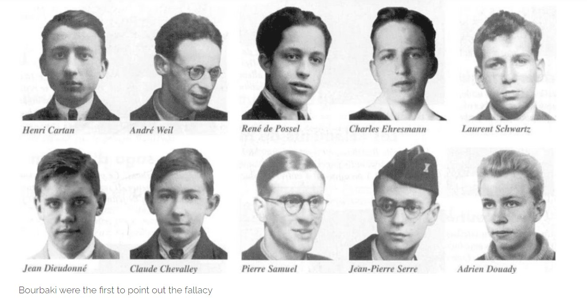
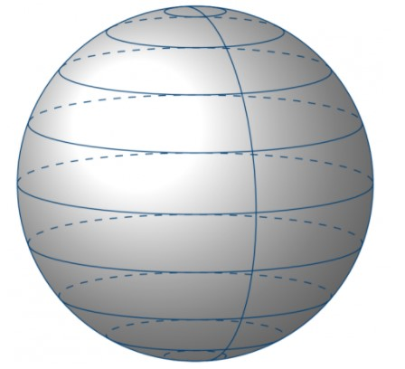

This explores the unsung sector of probability : **"Nonconglomerability"** and its effects on conditional probability. This also emphasizes the idea of how important is the idea countable additivity or extending finite additivity to infinite sets.

> *“I believe that we do not know anything for certain, but everything probably.”~ Christiaan Huygens*

One week into conditional probability, it's time to get our hands dirty with the **Law of Total Probability** and paradoxes which have emerged out of it.Let's be formal enough to state the law first.

### The Law of Total Probability

Adorably called **LOTP**, it is one of the cardinal results in Conditional Probability.

Suppose the events \\(A_1, A_2, ..., A_k\\) are a partition (mutually exclusive and exhaustive) of the event space and let **H** be any arbitrary event of the event space then it states that \\(\mathbb{P}(H) = \mathbb{P}(H|A_1)\mathbb{P}(A_1) + \mathbb{P}(H|A_2)\mathbb{P}(A_2) + ... + \mathbb{P}(H|A_k)\mathbb{P}(A_k)\\).

The day to day event I always relate to while recalling this law is that Suppose you have a thin glass block placed on a table and accidentally some water has been spilled on it. A part of this water has been trapped in between the surface of the table and the glass. If you look at this from above, you will see a puddle of water almost circular,trapped within the rectangular block. This puddle is actually our arbitrary event **H** and our block the event space. How can you get the partitions? Any wild guesses? Well, drop a hard stone on the glass and it cracks, or even if you have strong arms and like fantasizing about hurting your knuckles, you can do it too :P. The cracks partition the sample space into various segments and there is water trapped in each of them. There you go!

As we have stressed already, from a false proposition, or from a fallacious argument that leads to a false proposition - all propositions true and false, may be deduced.But this is just the danger;if fallacious reasoning always led to absurd conclusions,it would be found out at once and corrected.But once an easy , shortcut mode of reasoning has led to a few correct results, almost everybody accepts it; those who try to warn against it are generally not listened to.

When a fallacy reaches this stage, it takes on a life of its own and develops very effective defenses for self preservation in the face of all criticisms.Here is one such instance.

### Nonconglomerability

If \\(C_1, C_2, ..., C_n\\) denote a finite set of mutually exclusive, exhaustive propositions on prior information **I** , then for any proposition **A**, we have :

$$\mathbb{P}(A|I) = \sum_{i=1}^{n}\mathbb{P}(A \cap C_i|I) = \sum_{i=1}^{n}\mathbb{P}(A|C_{i}I)\mathbb{P}(C_i|I)$$

As you all seen in the previous blog post, the prior probability \\(\mathbb{P}(A|I)\\) is written as a weighted average of the conditional probabilities \\(\mathbb{P}(A|C_{i}I)\\).

Now, it is an elementary result that the weighted mean of a set of real numbers cannot lie outside the range spanned by those numbers, i.e., if \\(L \leq \mathbb{P}(A|C_{i}I) \leq U\\); then necessarily \\(L \leq \mathbb{P}(A|I) \leq U\\).

**De Finetti** (1972) called this property as **"conglomerability"** of the partition \\({C_i}\\).

Obviously, non-conglomerability cannot arise from a correct application of the rules of probability theory on finite sets. It cannot, therefore occur in an infinite set which is approached as a well defined limit of a sequence of finite sets.

Yet, nonconglomerability has become a minor industry, with a large and growing literature.There are writers who believe that it is a real phenomenon, and that they are proving theorems about the circumstances in which it occurs, which are important for the foundations of probability theory. Nonconglomerability has become, quite literally, institutionalized in our literature and taught as truth.

Let us examine some case where **"nonconglomerability"** has been claimed to be true.

### Rectangular Array

This particular example by the famous trio **Kadane**, **Schevish** and **Seidenfeld** (1986).

We start from a 2 dimensional **(M×N)** set of probabilities :

$$p(i,j), 1 \leq i \leq M; 1 \leq j \leq N$$

The **sample space** is a **rectangular array** of **MN** points in the first quadrant. It will suffice to take some prior information **I** for which these probabilities are uniform :

$$p(i,j) = \frac{1}{MN}$$

Let us define the event **A : i < j**.

Therefore, \\(\mathbb{P}(A|I)\\) can be found by direct counting and in fact it is given by :

Now let us resolve this conditionally, using the partition \\({C_1, C_2, ..., C_M}\\). We have \\(\mathbb{P}(C_i|I) = \frac{1}{M}\\).

So, we get, 

These conditional probabilities reach the upper and lower bounds \\(U = \frac{N-1}{N}, \forall M, N\\), and **L = 1 - R**; if \\(M \leq N\\) and 0; otherwise, where **R = MN**.

Now, if we check the conglomerability criteria using these **L**, **U** , then it seems to work fine with no ambiguity. So, where can one possibly create a non-conglomerability out of this?

Just take \\(M \rightarrow \infty, N \rightarrow \infty\\) and look at the probabilities \\(\mathbb{P}(A|C_{i}I)\\). We try to evaluate these probabilities directly on the infinite set.

Then it is argued that, for any given **i**, there are an infinite number of points where **A** is true and only a finite number where it is false. Thus, the conditional probability \\(\mathbb{P}(A|C_{i}I) = 1, \forall i\\); yet \\(\mathbb{P}(A|I) < 1\\).

Now, consider the set of propositions \\({D_1, D_2, ..., D_N}\\), where \\(D_j\\) is the statement that we are on the jth row of the array, counting from the bottom. Now, by the same argument, for any given **j**, there are an infinite number of points where **A** is false, and only a finite number where **A** is true.

Then, the conditional probability \\(\mathbb{P}(A|D_{j}I) = 0, \forall j\\), yet \\(\mathbb{P}(A|I) > 0\\). By this reasoning, we have produced two nonconglomerabilities, in opposite directions, from the same model!!

But wait wait wait... aren't we missing something? I don't think this is a fallacy at all. Let's think of this elementary problem in analysis :

It was Gauss who pointed out that any given infinite series \\(S = \sum_{i}^{}a_i\\) converges to any real number **x** as per your choice.

Suppose you define the partial sums \\(S_n = a_1 + a_2 + ... +a_n\\). Define \\(S_0 = 0\\).

Write \\(a_n = (s_n - x) - (s_{n-1} -x)\\), so our series becomes :

$$S = (s_1 - x) + (s_2 - x) + (s_3 - x) + ... - (s_0 - x) - (s_1 - x) - (s_2 - x) - ...$$

The terms, \\((s_1 - x), (s_2 - x), ...\\) cancels out and BOOM !! Your sum is \\(S = -(s_0 - x) = x\\).

Pause for a moment and taste the BLUNDER!!

Hadn't a great man once said :

> *Apply the ordinary processes of arithmetic and analysis only to expressions with a finite number n of terms. Then after the calculation is done, observe how the resulting finite expressions behave as the parameter n increases indefinitely.*

Yes, exactly! even stalwarts like **Gauss**, **Weierstrauss**, **Abel** and many accompanying them did not follow this advice meticulously and in many cases reached wrong conclusions. If you can understand the fallacy of this proof, you can pretty well admire the forgery in the rectangular array problem.

Once one has understood the fallacy in the analysis problem, then whenever someone claims to have proved some result by carrying out arithmetic or analytical operations directly on an infinite set, it is hard to shake off a feeling that he could have proved the opposite just as easily and by an equally sound argument, had he wished to. Thus there is no reason to be surprised by what we have just found.

**Nonconglomerability on a rectangular array, far from being a phenomenon of probability theory, is only an artifact of failure to obey the rules of probability theory**.

### Borel-Kolmogorov Paradox

Another abuse of conglomerability, this has its name written down in the history books.

Suppose a random variable has a uniform distribution on a unit sphere. Now we choose a point randomly. We will do this in two ways :

> 1. Choose longititude \\(\lambda\\) uniformly from \\([-\pi,\pi]\\).

> 2. Choose latitude \\(\phi\\) from \\([-\frac{\pi}{2},\frac{\pi}{2}]\\) with density \\(\frac{1}{2}cos\phi\\).

The problem asks us to find the conditional distribution of **X** on a [great circle](https://www.caliper.com/glossary/what-is-a-great-circle.htm).

Because of the symmetry of the sphere, one might expect that the distribution is uniform and independent of the choice of coordinates. However, two analyses give contradictory results. First, note that choosing a point uniformly on the sphere is equivalent to choosing the longitude \\(\lambda\\) uniformly from \\([-\pi,\pi]\\) and choosing the latitude\\(\phi\\) from \\([-\frac{\pi}{2},\frac{\pi}{2}]\\).

For a line with longitude with \\(\lambda = 0, f(\phi|\lambda = 0) = \frac{1}{2}cos\phi\\).

Whereas, for a line with latitude \\(\phi = 0, f(\lambda|\phi = 0) = \frac{1}{2\pi}\\).

One is uniform on the circle , while the other is not! Yet both refer to the same great circle :O

Now, I am not going to geek the resolution of this paradox as it requires greater knowledge in probability theory which we will surely cover in future posts. But interested readers can go through **E.T. Jaynes'** explanation of the same.

We will be back with a few more posts in conditional probability and will try our best to enamor you with the various angles and spheres which are less trodden in probability.

Till then stay safe.

### References

> *Conglomerability and finite Partitions - Alan Zame* 

> *The Extent of Non Conglomerability of Finitely Additive Probabilities- Kadane, Schervish, Seidenfeld*

> *Probability Theory- the logic of science - E.T. Jaynes*

---

We encourage discussions and queries, along with sharing of ideas and concepts, through this *Disqus* thread below. Feel free to share and interact! 

---

<noscript>Please enable JavaScript to view the <a href="https://disqus.com/?ref_noscript">comments powered by Disqus.</a></noscript>

