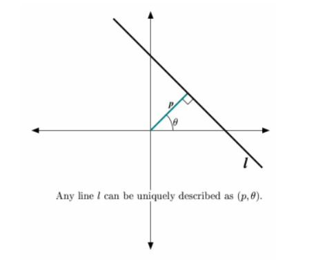
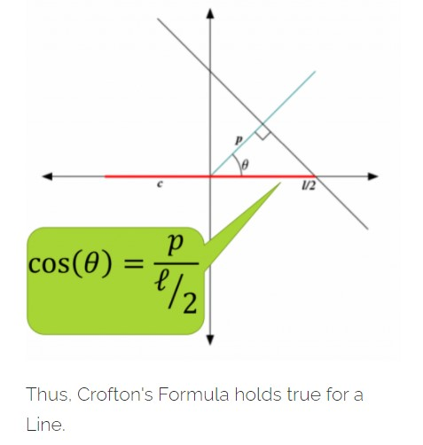
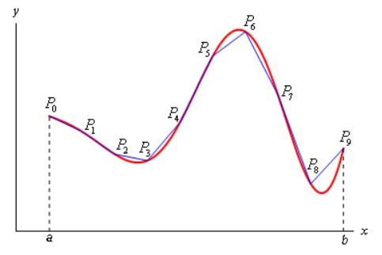
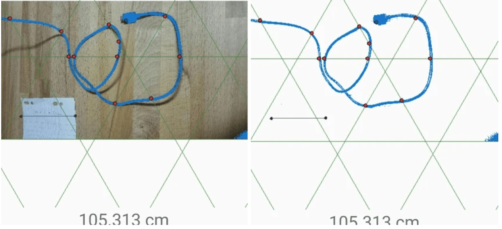

This article teaches how to mathematically find the length of an earphone wire by its picture.

Let's explore some truths.

* A Line is made up of Points.

* A Curve is made up of Lines.

* Earphones are as Messy.

This article is all about connecting these three truths to a topic in **Probability Theory** intersection **Geometry**, which is not so famous among peers, yet its' usefulness has led one to make an app in Google Play Store, which has only one download (by me). The sarcasm is towards the people, who didn't download, (obviously).

Today is the day for **Cauchy Crofton's Formula**, which can measure the length of any curve using random straight lines by counting points. It is all encoded in the formula.

$$L(c) = \frac{1}{2} * \int\int n(p,\theta)dpd\theta$$

This is the beginning of a topic called **Integral Geometry**.

This formula intuitively speaks the truth,

> *The Length of a Curve is the Expected Number of Times a "Random" Line Intersects it.*

### Descrbing a Line (like seriously?)

*I mean a "Random" Line*.

Thus the **Space of all Lines** in \\(\mathbb{R}^2\\) can be represented in **"kinda"** polar coordinates \\(S = {(\theta,p)|0 \leq \theta \leq 2\pi, p \geq 0}\\), where **p**, \\(\theta\\) are as indicated.

Now, we are now **uniformly** selecting this \\((\theta,p)\\) over **S**. This is how we select a **"Random"** Line.

### Understanding Crofton's Gibberish

If **C** is the curve, whose length we are interested to measure. Then, \\(L(C) = \frac{1}{2} * \int\int n(p,\theta)dpd\theta\\).

> **L(C) = The Length of the curve**

> **\\(n(\theta,p)\\) = The Number of times "Random Line" corresponding to \\((\theta,p)\\) intersects C**.

**Crofton** meant the following on a pretty, differentiable, and cute (regular) curve **C** that:

$$L(C) = \frac{1}{2} * \mathbb{E}_{(p,\theta)}[n(p,\theta)]$$

### The First Truth

Here, we will find the length of a Line using "Random Lines". We will see, how counting points on the line, can help us find the length of a line.

Here, we choose **C** = Line.

A Line intersects another Line exactly once; \\(n(p,\theta) = 1\\). Hence,

$$L(C) = \frac{1}{2} * \int\int n(p,\theta)dpd\theta = \frac{1}{2} * \int\int dpd\theta = \frac{1}{2} * \int_{0}^{2\pi}(\int_{0}^{|cos\theta|\frac{1}{2}}dp)d\theta = \frac{1}{2} * \int_{0}^{2\pi}\frac{l}{2}|cos\theta|d\theta = l$$

### The Second Truth

**Approximate Curves by Lines**.

Refer to **Approximation of Curves by Line Segments by Henry Stone**.

### Just Limit!

Now, take apply the result on these lines. By linearity of expectation and the uniform convergence of the Lines to the Curve, we get the same for the curve.

Suppose that the curve **C** is parametrized on the interval **[a,b]**. Define a partition **P** to be a collection of points that subdivides the interval, say \\({a = a_0, a_1, a_2, ..., a_n = b}\\).

Define, \\(L_{r}(C) = \sum_{i=1}^{n}|c(a_{i-1}) - c(a_{i})|\\) 

Then \\(L(C) = \text{sup}_{r}L_{r}(C)\\)

Now, each of the \\(|c(a_{i-1} - c(a_{i})|\\) are approximated by the **Crofton's Formula**. Now, taking the limit gives just eh required result. **QED**.

### Measuring the Length of an Earphone

Create a **Mesh of Lines** (Coordinate System) - A Fixed Sample representing the Population of the Random Lines. Then count the number of intersections using those mesh of lines only and add it up.

The mathematics of the above argument is as follows.

* Construct a grid of lines parallel to the **x**-axis at a distance **r** apart.

* Rotate this family of curves about the origin by \\(\frac{\pi}{3},\frac{2\pi}{3}\\) to get a system of 3 parallel system of lines. (We can make this finer).

* Now if a line in the grid intersects a curve n times, there might be more intersections if we consider all lines in \\(\mathbb{R}^2\\) - we only know about the grid lines. The parameters of these unknown lines can range from **0** to **r** and from **0** to \\(\frac{\pi}{3}\\).

* Therefore we can approximate the length of **C** by :

$$L(C) = \frac{1}{2} * \int\int n(p,\theta)dpd\theta \approx \frac{1}{2} * nr * \frac{\pi}{3}$$

An example is show below. This is done in the app named [`Cauchy-Crofton App`](https://play.google.com/store/apps/details?id=com.the.unknown.cauchycroftonapp&hl=en_US), which unfortunately is not working now and I have reported.

