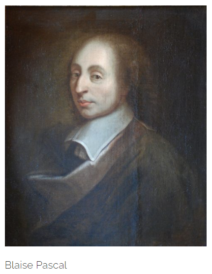
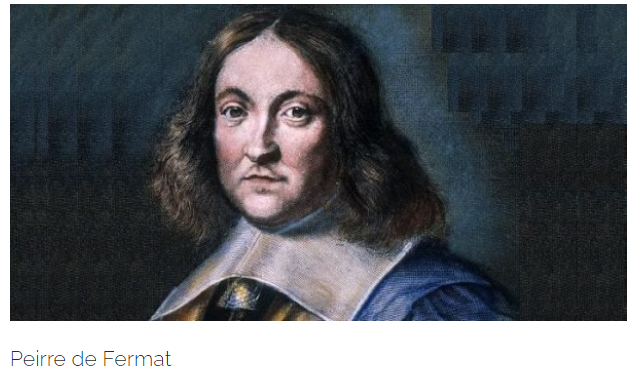
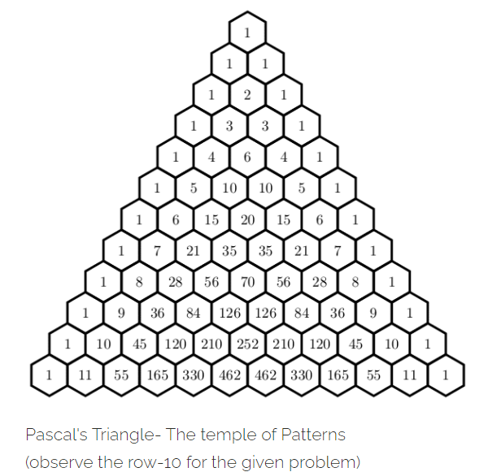

Human revolutionized and extended her/is restrictions on perception to natural phenomenon, when s/he started thinking about chances. We already know what crucial roles chances play when we cross the road on a busy traffic or while playing a game of 29 (card game), you show a card expecting your opponent doesn't show the joker (card with highest points) of the same color. Hold on ! did I say **"expecting"**?

So how about discussing a problem on how we actually quantify what we are actually expecting when uncertainty is playing her mighty tricks ? Let's present two very fundamental problems on mathematical expectation which are some of the most early documented problems on mathematical expectations or probabilistic means, encountered by two most significant mathematicians of that century. After little bit of background stories we will finally converge into the problems and present the intuitions and ideas the two Greats developed to solve those problems.

### Letters conveying thoughts

It was in 1654, after 78 years after **Cardano's** (the man who first developed, the mathematics of probability) death and 9 years before Cardano's works on The Game of Chances got published posthumously, correspondence of letters started between two mathematician exchanging ideas on how to solve some gambling problems, and as it happens they both ended up setting essential rules in the subject.

Hence these letters exhibits the first substantial works in mathematics of Probability. These two greats showed how seemingly complex problems can be reduced to straight-forward calculations when required subtlety has not escaped the eyes of the solver.

The main aspects they focused on was fairness and expectation or probabilistic means.

These two were namely **Blaise Pascal** and **Pierre de Fermat**, who formally defined the present form of mathematical expectations while building the idea of fairness in an uncertain game. They mainly exchanged their thoughts on two problems, which was encountered by Pascal, when he was asked by one of his Parisian gambler friend **Gamboud** , the Chevalier de Mere. Fermat on the other hand mainly known for his interests and works in Number Theory, was getting inclined towards the idea of tackling uncertainties, and hence replied the letters immediately, which he was receiving from Pascal, explaining the problems and possible approaches.

Well before, putting the problems, just as the justification of the title I gave for this article, this correspondence which started seemingly voluntarily was very unexpected indeed and also cause of chance, as in his rest of his life (as a problem solver) Fermat never collaborated neither published any of his works. Once Pascal pressed him to publish some of his works and Fermat replied : " Whatever of my work is judged worthy of publication , I do not want my name to appear there " , such a secretive man was Fermat. Though ironically and very rightfully, there exists many theorem under the name "Fermat" in the present day mathematics. So, we can claim that this collaboration, doesn't matter how successful it turned out to be, it remains one of the unexpected and unlikely collaboration in the history of evolution of mathematics, and the man who induced this unlikely event was Father Mersenne , after who's name we have the **Mersenne Primes**.

### So, what are the problems?

There are basically two problems, as they follows

> *Problem of dice* - A player will roll a dice 8 times, and he needs to throw a 6 within this 8 throws, now 3 throws have been made and none of them resulted in a 6 and a stake is being settled. So, what proportion of the stake would be fair to give to the player to forego his fourth throw (only fourth ) ?

And the second problem is a bit of complex and funny in respective sense,

> *Problem of points* - Gamboud and another player were involved in a game of dice rolling and the rule of the game was, first one to reach a certain number of points wins and collects the whole stake. Now they started playing and after certain number of rounds, as it happens the gamblers got themselves into an argument and ended up being in front of Pascal, demanding a fair division of the stake as they are not interested in completing the game and put a stop on their argument.

So, basically Pascal needed to calculate the chances of wining the game of each payer if they had continued the game and divide the stake according to the probabilities of winning of individual players assuming that both players has same probability of winning each point.

### Pascal reaches out to Fermat

Observe that both the question deals with a common requirement of fair judgement. But Probabilities in those days were mainly based on intuition and experience of gamblers (remember Cardano, himself was a gambler, and idea of probability to him was just a survival strategy). Pascal who had no experience of gambling reached out to Fermat to share his ideas and they ended up employing the concept of expectation to answer the question of fairness.

The expected value of a gamble that pays off  (say), in outcome **x** is the probabilistic weighted average or probabilistic mean, defined as,

where,  are the individual probabilities of the outcomes  respectively.

They both argued that *"A transaction that leaves the players expected value unchanged is assumed to to be fair"*. For example consider flipping a fair coin. If it comes up Head you win 1, and if tails turn up you loose 1. Then the expected value is .

### Fermat rectifies Pascal

n the letters exchanged between the two mathematicians it is found that Pascal first made an error that, he claimed that throws that the player lost, earned him th of the remaining stake, which makes by his theory that if the player should earn,  of the total stake if he agrees to forego his fourth throw !! But Fermat explains that he is mistaken and provides the solution himself.

Fermat writes,

> *....you proposed in the last example in your letter (I quote your very terms)b that if I undertake to find the six in eight throws and I have thrown three times without getting it and if my opponent proposes that I should not play the fourth time, and if he wishes me to be justly treated, it is proper that I have  of the entire sum of our wages. 
This is however not true by my theory. For in this case the three first throws having nothing for the player who holds the die, the total sum thus remaining at stake , he who holds the die and who agrees to not play his fourth throw should take  as his reward. And if he has played fourth throw without finding the desired point and if they agree that he shall not play the fifth time , he will nevertheless have 16 of the total for his share. Since the whole sum stays in the play it not only follows the theory, but indeed common sense that each throw should be of equal value.*

So, basically Fermat, claimed that in order to conduct a fair game, the expected value of the game must not change depending on the fact whether a player is foregoing a round taking a proportion of the stake or continue to play the game.

Let us explain Fermat's argument, more elaborately and mathematically, considering two cases, as,

* **Case 1** - Suppose the stake **s** is settled after 3 throws (6 came in none of those), and our friend is left with 5 throws and he plays the 4th round, then he is expected to win the stake s with probability  (probability of getting a six) or loosing the 4th throw with probability  (probability of getting anything but 6) but winning the stake **s** in one of the 4 remaining rounds thereafter with probability  (probability of getting at least 1 six in any of the 4 throws). So, mathematically the expectation becomes,

* **Case 2** - Suppose the player foregoes his fourth throw for  of the stakes, then according to Fermat's suggestions in the letters, his expectation is,
 of the stakes **s** due to his foregoing of the 4th round with rest of the remaining  of **s**, with probability  (probability of winning in the remaining 4 rounds). Hence, while foregoing his fourth throw the player expects,

So, clearly, in both cases the expectation of the player remained same as stated by Fermat, so  of the stake is the fair price for foregoing the fourth throw. Using Fermat's argument one can easily generalize this solution, hence I leave that task upon the readers.

### Fermat gets the once again

The second problem **"Problem of points"** is also an expected-value problem, which roots back in 1494, when **Fra Luca Pacioli** considered a problem where the play is complete with 6 points, one player has won 5 points and the other 3. **Pacioli** argued that the fair division would be according to the proportion to the rounds already won 5 to 3 . About 50 years later **Tartaglia** objected that according to this objected that according to this rule if the game were stopped after 1 game, then the person winning that only game would take the whole stake !! After objecting when he himself tried the problem he ended up being puzzled by the perplexity which later also baffled the likes of **Cardano** and the **Chevelier de Mere**.

But Fermat immediately got the key once again and stated more generally that if the Player-1 needs **p** points more and the Player-2 needs **q** points more to win the game, then the result of the game can be determined by playing at most **p+q−1** games. Then he used a very important step which to this day remains a very efficient techniques to the present day problem solvers. What he did is just mapped each rounds of the **p+q−1** games to be payed with the event of tossing a fair coin, **p+q−1** times where each toss representing each round of the game. This is called **bijective mapping** in mathematics, where you just look outcomes of a phenomenon which has exactly identical outcomes of the event we are interested in. Here he basically mapped the win and loss to the two faces of the fair coin and since we assumed that each player has equal probability of winning each round, so its just like win (or head) with probability  and loose (or tails) with probability . Hence the problem reduced to a set of events which have equiprobable outcomes, and thus is the subtlety which I was talking while explaining the nature and trick to the problem.

So, if we consider Pacioli's problem, where Player-1 has 5 points and Player-2 has 3, since 6 concludes the game, 3 (1+3-1) more games will suffice. Now if we think of tossing 3 fair coins, then we will have 8 () equiprobable outcomes, but Player-2 who needs 3 points must win all three of the games, that is he/she must have (win, win, win) (or, (heads, heads heads)) outcome, and chance of getting all 3 wins (heads) is , which makes the chance of Player-1's win  (or, ()). And hence, Player-1's expectation on the stake becomes  of the stakes.

Here, Fermat just magnified his views over the outcomes of each round and since the outcomes are symmetric, he can extended his observation over a set of games played. in modern Probability theory , we use this method which we sometimes call the fundamental bridge, which breaks an random variable (here points scored by each player after a set of games have been played), into some finite number of indicator random variables (here, 1 point scored if one wins or 0 if looses in each game). This technique helps tremendously in finding complex expectations, even when you don't know the distribution of the random variable. Hence this work of Fermat initiated the first step towards erecting the pillars of the fundamental bridge in probability theory.

### Pascal genralizes with Pattern

Imagine Fra Pacioli's problem in a modified set up, where in the game where win comes at 6 points , Player-1 has no points and the other has only 1 point .So by Fermat's argument, the players needs to play at most 10 (6+5-1) matches . Now here using the fundamental bridge and tossing a fair coin 10 times leaves us with 1024 () equally likely outcomes, which is no more possible to count like the the previous one. Obviously, we don't have all day!! But now Pascal had an idea.

To count the cases in which one of the players must win at least 6 rounds, she can win exactly any 6 out of 10 trials in [ 10 choose 6] () ways, again exactly 7 win out of 10 trials in [10 choose 7] () ways,..... this way....,10 wins out of 10 trials in [10 choose 10] () ways. And these numbers can be found to be lying on the 10th row of the Pascal's triangle. The particular row tell us number of ways we can choose "wins" from a group of 10 "outcomes"( of "wins" and "loss" only).

In this particular problem, Pascal needed the number of ways getting 6 wins in 10 trials + 7 wins in 10 trials +.....+ 10 wins in 10 trials, which from Pascals Triangle found to be , 210 + 120 + 45 + 10 + 1 = 386.

So, for a probability of winning of  (which is about 38% , from here calculating the fair division is already explained earlier).

These solutions and generalizations by Pascal and Fermat opened the gate of handling equiprobable cases using combinatorial principles and provided insights on the fairness of a game and measuring of mathematical expectation, which later turned out to be most important and fundamental measure besides Probability itself in theory of Statistics and Probability.

### Pascal gives the finishing touch

Before concluding I just want to put light on another approach which Pascal provided to solve a modified version of the "Problem of points" , without discussing about this beautiful approach, I think this article on "Probabilistic means" will remain, incomplete.

Pascal proposed a problem and its possible approach to Fermat in one of his letter as,

> *" Let us suppose the first of them has two (points) and the other one. They now play on throw of which the chances are such that if the first wins, he will win the entire wager that is at stake, that is to say 64 pistoles. If the other wins they will be two to two and in consequence, if they wish to separate it follow that each will take back his wage that is to say 32 pistoles.
Consider then, Monsieur that if the first wins, 64 will belong to him. If he looses 32 belong to him. then if they do not wish to play this point and separate without doing it, the first would say, **"I am sure of 32 pistoles, for even a loss gives them to me. As for the 32 other , perhaps I will have them and perhaps and perhaps you will have them the risk is equal. Therefore let us divide the 32 pistoles in half (16 each) and give me 32 of which I'm certain besides"**. He will then have 48 (32+16) pistoles and the other will have 16."*

Pascal basically used the situation of draw clearly to create a definition of fairness which is very difficult to argue over. He finely differentiated what part of the stakes surely belongs to the leading player, and what part of the stake still requires to be partitioned over uncertainties.

Pascal further extends his idea to solve more general problem, when say one player is leading by 2 points (or p points more generally) and they start playing for a point where if the one leading wins , takes the lot. Can you find the fair share if they doesn't wish to play the rounds further ? What do you think the fair share would be if one leading looses the match and now just leading by a point ?? Are you thinking of using recursion of the argument Pascal provided for the case of "2 to 1 points"? Well that's what Pascal himself did, try completing the rest yourself !!

Pascal's method of recursion , was the final touch of artistry to the solutions to the problems and the definition of fairness and its relation to the probabilistic means. This method of calculation makes the solution more general and it lives till today to solve problems on conditional expectation. And since recursion involves much insights over recognizing the patterns inherent in a certain problem associated with seemingly random outcomes, Pascal's procedure of calculating probabilistic mean still now attracts bunch of problem solvers and probability fanatics who are inclined to the mathematical aspects of quantifying chances. This method helps to solve problems involving in games, patterns in outcomes of a sequence of coin tosses, which has extensive application in many fields of Physics and Genetics. Coin tossing is itself a topic which demands discussion on its own right, lets keep it for another day.

### A Dice yet to Roll!

I often find thinking over mistakes and disputes in arguments often help us getting more insights over the subtle truth which is puzzling enough. So I suggest,
Trace back to the section **"Fermat rectifies Pascal"**, can you explain where Pascal went wrong in his argument, which I left unexplained for you to figure out !!

### References

> *Ten Great Ideas About Chance - Persi Diaconis & Brian Skyrms.*

> *Pascal and Fermat on Probability - Vera Sanford.*

> *Do dice play God - Ian Stewart.*

> *Fermat's Last Theorem - Simon Singh.*

