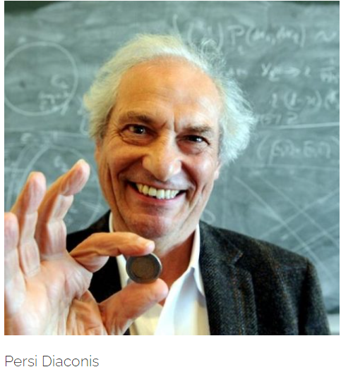
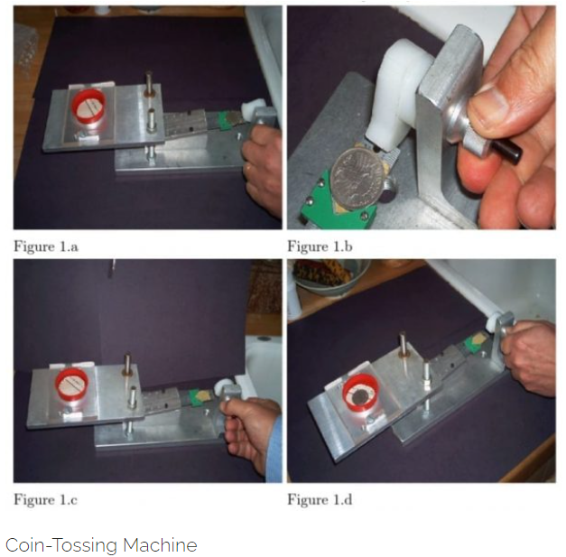
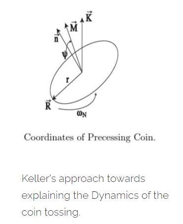
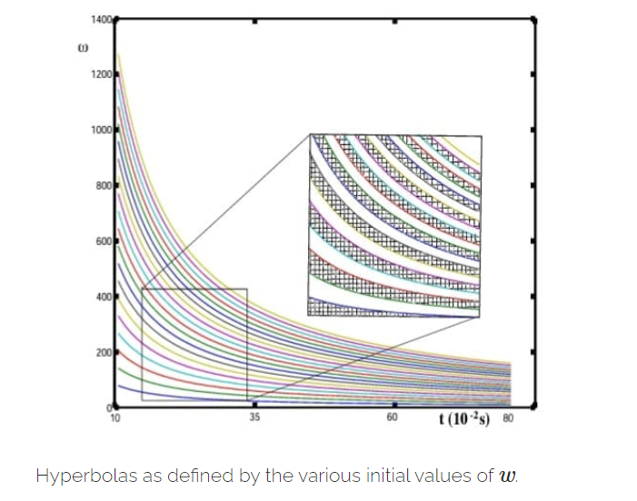
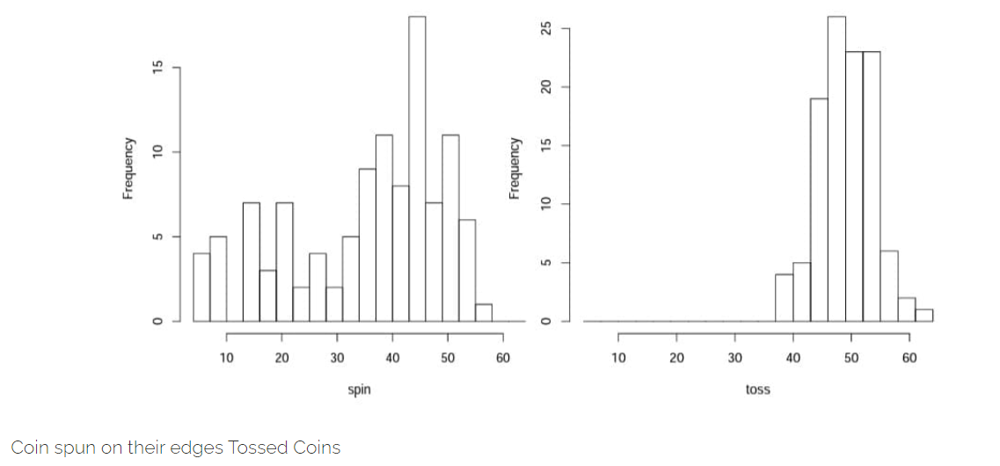
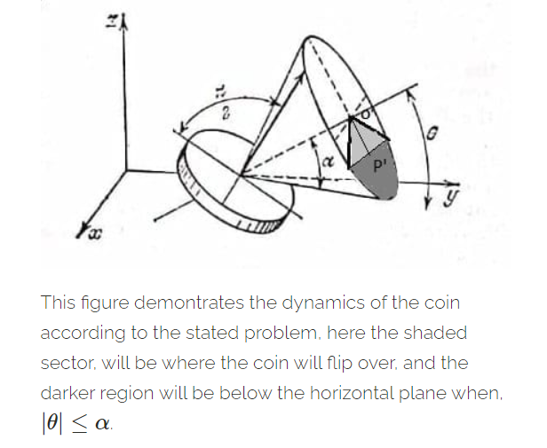
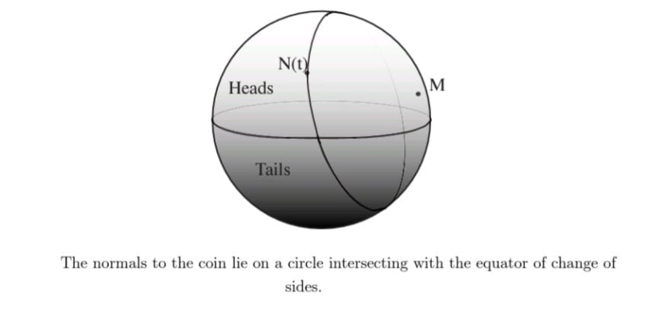
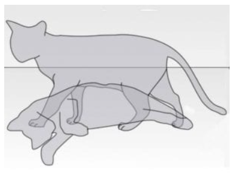

> *"It is a very tedious task !! First you have to calculate where he is and where is is not, then you must calculate where he could possibly be, then you must seek where he is at this moment, then finally you have to calculate the probability that what is the chance of finding him when you reach, where you are suspecting him to be right now."* - **Sukumar Ray in his Novel : "Utter Nonsense"(Ho-Jo-Bo-Ro-Lo)**

Uncertainty is something that has drawn attention of mathematicians ad philosophers right from the beginning of the modern civilization. There has been many school of thoughts about the true nature of uncertainty, which also changed and is keeping changing as the mathematics is getting sophisticated gradually. The perspective of uncertainty that was (is) very much appealing to me originated from the perspective of the great probabilist **Bruno de Finetti** is **"Uncertainty is actually the quantification of our ignorance of the lack of information"**. This straightaway made the idea of probability subjective, which should be a topic for discussion for another day. But one of the living legend and an ambassador of this school of thought Persi Diaconis is man who is obsessed with the way the most fundamental places where the uncertainty exists, goes further finding a physical solution to the problem of quantifying uncertainty, which our present discussion is all about.

In statistical experiments lack of knowledge do motivate statisticians to develop more sophisticated laws of predictions, and statisticians gain only that much knowledge that they can afford given a cost. So, lack of knowledge is what induces the desire of prediction in extension handling uncertainty. They basically do a mapping of knowledge gain with cost, though cost-gain of knowledge relationship is a different topic altogether and not really a core probability stuff, but from this we end up with two most important philosophical questions:

* What is uncertainty?

* Can we actually gather all the information if we have a luxury of infinite investment ?

You can see clearly that the both questions are correlated and assuming on gives you the justification for another, and I choose to discuss on the first question as that is also a more general one.

### Is Coin Flipping Random?

There are quite a number of fundamental models that engage probabilists and mathematicians in their quest for the actual nature of uncertainty, coin tossing being the most basic and fundamental of them, made the great mathematician and probabilist **Diaconis** obsessed and he dived in the search of the true nature of uncertainty. Inspite of the simplicity of the experiment, and the number of unknowns are many and they accumulate to an ultimate uncertain system, which are subject to physical changes that one can't possibly have the luxury to be aware of. But Diaconis being an obsessed man, follows the thoughts of de **Fenetti** and questions, **"Is coin tossing is truly random, or its just our ignorance over the physical parameters?"**.

What if we knew about the magnitude of the force that our thumb imparted on the coin? At how many spins per second the coin spun while going up or coming down ? At what velocity the coin went up ? How high did the coin went before it succumb on the ground ? What about the collisions with the air?

If we if can answer these questions, then Physics allows us to completely determine the outcome of coin flipping, so coin tossing is not at all random, its Physics !!

Diaconis is so obsessed by the enigma of the uncertainty, he claimed that coin tossing involves the law of mechanics( ignoring the effect of air molecules). To demonstrate this, he had had the physics department build him a coin-tossing machine. The coin starts out on a spring , the spring released, the coin spins upward and lands in a cup (as shown in the figure). Because the force imparted are controlled he claims that the coin always lands with the same side up. Magicians and crooked gamblers (including Persi Diaconis himself) also possess such abilities. I further suggest the interested readers to read articles and watch videos of Diaconis on coin tossing and game of cards, you will be amazed. Those are the reason, I feel he is among the very few who worked extensively and mathematically over the philosophical questions about uncertainty.

The careful study of flipped coin started by Keller (in 1986). he assumed that a coin flips about an axis in its plane with spin about this axis at a rate **w** revolutions per second. If the initial velocity in the up direction  is , after **t** seconds a coin is flipped from a height  will be at height . If the coin drops at a surface the time elapsed **t∗** satisfies,  or  (simple equations of motion). This coin will revolve  times. If this is between **2j** and **2j+1** the initial side will turn up. If it is between **2j+1** and **2j+2** the opposite side turns up.

The figure shows a space **(w,t)** in the regions where the coin goes up as the same side or the opposite side. The edges of the hyperbola . Visually the regions get closer together, implying that small changes in initial conditions make for the difference between heads and tails.

How then is the probabilistic treatment of coin flips so widespread and so successful ? the basic answer was given by Poincare. If a coin is flipped vigorously, with sufficient vertical and angular velocity, there is a sensitive dependence on initial conditions. Then a little uncertainty as to initial conditions is amplified to a large uncertainty about the outcome, where equiprobability of outcomes are not at all a bad assumption.

In 1992, **Engel** carried on the work based on Keller and fitted a probabilistic model on the velocity and spins per second and even he too ended up concluding that the chance of getting head is nearly half and inspite of accounting for the velocity and spins it seemed difficult to argue on the fact that almost with equal chances one can obtain head or tail.

Engel proposed a theorem that considered two probability distribution on velocity v and spin per second w and gave a bound on the chances of getting a head and found that the chance revolves around .

So, even in a classical mechanical set up, the entire uncertainty can't be wiped out completely.

### Does Fair Tosses only depend on Fair Coins?

According to Persi Diaconis's observation , coin tossing outcomes are heavily dependent on the way it is tossed up. The exact determination of the bias depends in a delicate way on the shape of the coin's edges also, which are used by magicians to trick naked human eye. (We will see this fact as a consequence in a problem, which we will solve later). He even goes further to suggest that the coin tossing gives a lot more unbiased result when tossed say 100 times, but the same penny when spun showed reasonable bias towards tails. We provide the result in a histogram comparing the outcomes of coin tossing and coin spinning. Diaconis further extends his search for uncertainty in coin flipping explaining more about physical chances, which interested readers can make their way further to those.

Explaining and discussing the approaches and ideas that are associated in understanding the physics behind the coin flipping, lets shift ourselves to some beautiful problems which involves and explains the physical geometry and the classical mechanical fundamentals which influences the outcome of the toss.

### Wishful Coin Tossing

Suppose you are tossing a coin, you know nothing about its fairness, we assume that the thickness of the coin is negligible, the coin is tossed, what is the chance of getting a head ?

Now, here we really know next to nothing about the initial conditions, which we saw impacts the outcome heavily. So here we will deal with this problem geometrically, but don't forget the fact that classical mechanics is basically originated from this kind of mathematics. Hence, lets assume that after the coin strikes the surface the vector of the normal  applied on the heads side of the coin generates a cone (follow the figure). The axis of the cone makes an angle  with the horizontal plane and  is the angle between the generatrix of the cone and its axis. 

When the coin hits the ground and starts spinning before settling finally, the normal vector spins randomly over the circumference of the base of the (imaginary) cone. Now imagine that coin is in any arbitrary position (as given in the figure).

Now observe that it is quite obvious from the figure that if , then the coin will surely not flip over .i.e., heads will come up.

Similarly if , then the coin will surely flip and heads will never come up.

But when , then we have to observe the rotation of the normal vector  more closely, and have to locate the regions on the circumference where if the normal vector stops will result in the flip over of the coin. Further observe that the coin will flip over whenever the normal vector will intersect(or penetrate) the horizontal plane. It is hard to imagine, the figure and ones own imagine is what I can offer for clarification. Observe that part of the base of the cone that will be immersed within the horizontal plane will be part of the circumference that will flip over the coin.

So, observing the figure, if say **O′P = r′** and radius of the base of the cone is **r** and the height of the cone is **h**. Using further simple properties of the circle, we need to find the circumference of the shaded sector as in that part of the circle, the coin will flip over, following the argument we established above. Then,

 and 

Let the angle of the sector be  (angle at **O′**).

So, 

So, 

Hence, 

So, we can also say that the toss will be fair when , .i.e., , which we can conclude also from the figure that if the axis of the cone becomes parallel to the horizontal plane there is a equal chance of falling on either side and expose any of the faces.

If you can toss a coin such that it first lands on its edges when it hits the ground (surface), then even with a biased coin you can perform a fair toss !!

So, as Diaconis claimed that edges play an important role in determining the outcome of a toss, this problem showed the same. Actually when you see magicians tossing a coin and claiming tat heads will land (as Diaconis does this himself) and truly ends up with a head, then you can be sure about the fact that he/she always using the "" case. Though in this problem I used lesser parameters (as compared to standard mechanical models), still I claim that I ended with a quite satisfactory chance of getting, since the geometry was specific and subtle enough to cover the all the possibilities after the coin hits the surface.

Can you control the uncertainty on the edges of the coin like the magicians? Try it !!

### Edgy Tossing

Suppose I ask you about the chance of a coin landing on one of its faces, you may think its how foolish of me to ask such a question, and smartly gave the reply that " landing on of its faces is a sure event man !!", and then I further argue with strong mathematical logic that we can always assign some chances on the event that the coin may sometimes land on its edges !! Edgy right !

Imagine a thick coin, (for psychological convenient), now we can actually assume the coin as a cylinder right ! a flatter one perhaps. Say the coin has radius **r** and thickness **h**, even though the mass is accountable we ignore the mass for simplicity. Now you rolled the coin (cylinder), what is the probability you think that the cylinder (coin) lands on its lateral surface (edge) ?

Try this problem yourself !! Use the assumption that Keller used, that is the normal vector of the coin will rotate in a spherical space, and you have to use the idea of Solid angle of the geometric shapes you wish to use in analyzing the phenomenon. If you don't know what is a solid angle, then give a brief read on the topic and come back to the problem !! Good luck !

I tried the problem with a standard coin of diameter (**2r**) **19.05 mm** and thickness (**h**) is **1.52 mm**. I ended up with the fact that there exists about 3% chance of the coin to land on its edges !! Hence landing on edges are not at all impossible, on the contrary it is edgy enough !!

### The Coin finally becomes Schrodinger's Cat!

So, till now we have been talking about how Classical Physics try to explain what are disguised as uncertainties, but at the end of every instances we failed to free ourselves from chances. Though we must admits that Laws of Mechanics explain some part of the uncertainty, leaving us to propose a "model of uncertainty" for better understanding of our readers, the model is as follows ,

> *Uncertainty = "Lack of Classical Mechanical information" + "Error"*.

Now before concluding, we will just discuss and try to argue from where this error coming and what is this error actually represents.

According to the latest researches, of two physicists **Andreas Albrecht** and **Daniel Philips** of University Of California, they argue that probabilities we use in our daily life and science do not "quantify our ignorance" but instead reflect the inherent random nature of the physical world as described by Quantum Mechanics.

They claim that the reason we fail to determine the coin toss outcome even after accounting for most of the classical parameters is because we cant anticipate the collisions of the air particles due to Brownian motion over the surface of the coin which in turn leaving its invisible impact on the instantaneous velocity and spins of the coin, Remember **Heisenberg's Uncertainty Principle** !!

They infact, claim that anyone who is tossing a coin is actually performing Schordinger's Cat Experiment. But rather than a cat that is both alive and dead the quantum object in this case is a coin whose final state is here Heads or Tails (or Edge !!). hence outcome of the flip generally remains genuinely open until the upward face of the coin is looked at which the system takes a definite value of either Heads or a tails.

So, basically what uncertainty stands to be is that "Uncertainty is the manifestations of Quantum Chanciness ." Hence our intuitive model of uncertainty modifies as follows,

> *Uncertainty = "Lack of Classical Mechanical information" + "Quantum phenomenon"*.

This is also the instant where classical probabilities branches up to their respective directions. I hope our interested readers will find themselves hanging on any of these branches. Will you toss a coin to choose a branch ?? What do you think !!

### A Dice yet to Roll!

If you have solved the problem left as an thought exercise in "Edgy Tossing " , then take some rest and think again !!

Suppose the chance of the coin landing on its edge is , How thick you think the coin should be !! Do you Have any idea !!

You can share them with us perhaps !!

### References

> *Dynamical Bias in the Coin Toss - Persi Diaconis, Susan holmes and Richard Montgomery.*

> T*en Great ideas About Chances - Persi Diaconis & Brian Skyrms.*

> *The Quantum Coin Toss- Edwin Cartlidge, PhysicsWorld.*

> *Problems in The Theory of Probability - Sevastyanov, Chistyakov & Zubkov.*

> *Fifty Challenging Problems in Probability - Frederick Mosteller.*

> *Special Thanks to my friends Avishek Dutta and Soham Ghosh (also the co-writer of this blog), for some discussions which turned out to be productive while writing this article.*

---

<noscript>Please enable JavaScript to view the <a href="https://disqus.com/?ref_noscript">comments powered by Disqus.</a></noscript>

