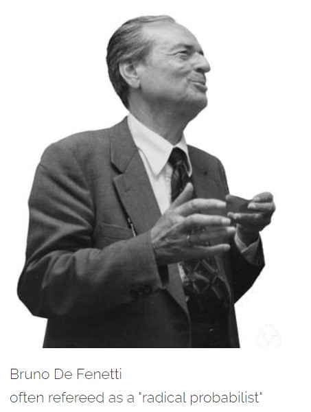
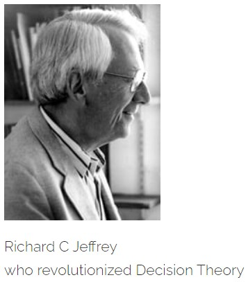

This post discusses how judgments can be quantified to **probabilities**, and how the degree of beliefs can be structured with respect to the available evidence in decoding uncertainty leading towards Bayesian Thinking.

> *The object of reasoning is to find out, from the consideration of what we already know, something else, which we do not know. Consequently, reasoning is good if it be such as to give a true conclusion from premises, and not otherwise. -C.S. Pierce*

In our quest for the actual form of uncertainty, and developing laws of chances, one of the most important thing is being judgemental.

Always, in life you don't have the luxury to observe a particular event finitely many times, and structure it in a known equi-probable frequency set-up as we have always tried in case of measuring chances. For example you just can't go out on finitely many cloudy days without an umbrella, to observe how many of the days it actually rains and you get wet. Of course, you can conduct this experiment, but on conducting such experiment, you could end up catching cold or even pneumonia.

But then again, if one fine day you woke up and see that its cloudy out there, and you felt that it may rain today so you carried your umbrella, but fortunately it didn't rained and carrying your umbrella was not of much use, so next similar day you didn't care to carry the umbrella and it rained !! : p

So, here you just relied in your judgement, which made you believe in the first day it would rain, but since it didn't rained again your judgement made you believe that it wouldn't rain the next day also, and you were misled by your judgement. So, now if you conclude that you should not rely on circumstantial judgement ! But again you are wrong ! Why ?? Well, that's what we are going to discuss here.

### Can Beliefs be measured?

Relying on personal beliefs and preferences, may not be encouraged well enough in conventional science, as it should not be, but mathematicians like **Bruno De Fenetti**, **Frank Plumpton Ramsey** and some others, suggested that if beliefs or judgements are made measurable (like we measure chances), then we can definitely keep our faith on them. So, now the question is are beliefs measurable ?? Won't those measures will be subjective??

Ramsey answers that too, in this essay **"Truth and Probability"** Ramsey writes,

> *"It is a common view that belief and other psychological variables are not measurable, and if this is true our inquiry will be vain ; and so will the whole theory of probability conceived as a logic of partial belief; for if the phrase 'a belief two-thirds of certainty' is meaningless, a calculus whose sole object is to enjoin such beliefs will be meaningless also. Therefore unless we are prepared to give up the whole thing as a bad job we are bound to hold that beliefs can to some extent be measured."*

He continues,

> *"But I think beliefs do differ in measurability in the following two ways. First, some beliefs can be measured more accurately than others; and, secondly, the measurement of beliefs is almost certainly an ambiguous process leading to a variable answer depending on how exactly the measurement is conducted. The degree of a belief is in this respect like the time interval between two events; before Einstein it was supposed that all the ordinary ways of measuring a time interval would lead to the same result if properly performed. Einstein showed that this was not the case; and time interval can no longer be regarded as an exact notion, but must be discarded in all precise investigations.*

> *I shall try to argue that the degree of a belief is just like a time interval; it has no precise meaning unless we specify more exactly how it is to be measured. But for many purposes we can assume that the alternative ways of measuring it lead to the same result, although this is only approximately true. The resulting discrepancies are more glaring in connection with some beliefs than with others, and these therefore appear less measurable. Both these types of deficiency in measurability, due respectively to the difficulty in getting an exact enough measurement and to an important ambiguity in the definition of the measurement process, occur also in physics and so are not difficulties peculiar to our problem; what is peculiar is that it is difficult to form any idea of how the measurement is to be conducted, how a unit is to be obtained, and so on."*

Now as Ramsey suggests that the idea, of how the beliefs will be measured was crucial here, but the had the answer for that too. What the did is that the made their judgements heavily dependent on the evidences, which the assumed to be quite certain. Though later we will see that evidences are not always certain, but that doesn't makes their measure falsified. Just we need additional machinery to handle the discrepancy in the evidence.

What De Fenetti and Ramsey did, is they expressed judgements and partial beliefs as mathematical probabilities, and believe me its here this mathematics of probability gets immensely powerful and beautiful. Now it is here where you feel that you can express every thought of yours in terms of mathematics.

In our last posts, we have always been talking about equi-probable cases, now even in the equi-probable scenario , your judgements are disguised as symmetry, and hence you don't even realize that you are judgemental by virtue. one of the obvious instance which exposes our virtue of being judgemental is we don't even consider the possiblity of a coin landing on its edge , which ( i discussed elaborately earlier) is afterall not impossible ( may be improbable). So, here we are putting our judgements on the nature of the coin .i.e., "its too thin to land on its edge".

### Wise Man always carries an umbrella

> *"Any fool carries an umbrella on a wet day, but the wise man carries it every day." — Irish Proverb*

Coming back to our example of the cloudy day, here you have no set of nice equi-probable set of cases, that can determine the chance of rain.

Well obviously you can say vaguely, "it rains or it doesn't, so its like a coin tossing", or you may further suggest, "I have been observing, that its been raining more or less 4 days a week, so the chance of raining today is about 57%." But the thing is, What about the overcast condition, is it not making you inclined towards the conclusion, "its going to rain" ? But again the question is how much we should be inclined towards the proposition "its going to rain" ?

De Fenetti would have said that since, you are certain about the fact that its cloudy, looking for the chance of raining is like ignoring the evidence that your are privileged of. That is here we must not look for the chance of raining as it is, rather here we must find the chance of raining when you already saw, that it is overcast out there. So, our judgement about rain is basically quantified as the probability of rain conditioned on the evidence that its cloudy.

So, if we say, **R** is the event (or proposition) *"its going to rain"* and **C** is another event (or proposition), *"there is a cloud-cover"*. Then probability that its going to rain, i.e., \\(\mathbb{P}(R)\\) is basically transformed to \\(\mathbb{P}(R|C)\\), where we read this as *"Probability its going to rain, given that there is a cloud cover"*. Hence the forecast you going to make is basically a coherent judgement of the situation which is basically expressed as conditional probabilities. So, here the concept of probability, reaches a spiritual level (if I may say so), where it is actually quantification of our belief based on evidences which are apparently certain. But still the question of transformation of belief to probability stays alive to be killed. :p

### Believing in Probabilities

Beliefs as such are definitely a vague thing to put our trusts upon, but once there is a mathematical support behind a particular belief it remains no longer inferior as mathematics herself stands with all her might to defend it.

Now extending our example of cloudy day, suppose you have quite a few detailed observations. Say you observe that during monsoon more or less 4 days a it stays overcast (from the morning), and again as you further observed that 3 of the cloudy days end up being a rainy day, and you already observed that 4 days a week it rains (more or less).

So, when it is known that it is cloudy out there, the chance of downpour becomes 3 out of 4 (or \\(\frac{3}{4}\\)), by your judgement. This is actually the chance generated from your coherent judgements are probability indeed.

De Fenetti showed that coherence is equivalent to one's judgeents having the mathematical structure of probability. He argued the judgements in a mathematical structure behaves like a proportion. (like in the above example we quantified our judgement by "3 out of 4" which is a proportion indeed ).He explained that while defining the chance of raining when you have observed the overcast conditions already, such chances (judgemental probabilities as called by De Fenetti) are basically proportions of classical probability of two propositions "its going to rain" and "its cloudy out there", i.e., \\(\mathbb{P}(R|C)\\) is basically the ratio of \\(\mathbb{P}(R \cap C)\\) (we read this as , probability that its going to rain when it is cloudy out there) and \\(\mathbb{P}(C)\\) (probability of its cloudy out there). So, \\(\mathbb{P}(R|C) = \mathbb{P}(R \cap C)\mathbb{P}(C)\\). Hence,

* a proportion minimizes to 0.

* it also maximizes to 1.

* Proportions of a combination of mutually exclusive parts, i.e., out of 4 cloudy days 3 of them ends up being rainy, and out of 3 clear sky-days (from morning) , 1 day it rains (in the evening may be due to sudden accumulation of clouds) so the total proportion of rainy day a week is 4 out of 7.

Hence, De Fenetti, showed that coherent judgements can be mapped to mathematical probabilities. He clarified the validity of other way also.

Suppose \\(D_i\\) represents the total number of rainy day in ith week when it was cloudy. So the total number of expected rainy days sums up as,

$$\mathbb{E}(D_1 + D_2 + ...) = \mathbb{E}(D_1) + \mathbb{E}(D_2) + ...$$

Now clearly, here as the individual expectations are non-negative, then there definitely non-negative number of rainy days on an average. Concluding that judgements that are mathematical probabilities are coherent.

Hence, De Fenetti concluded, 

> *"Judgemental probabilities are coherent if and only if they have the mathematical structure of classical probabilities."*

**De Fenetti used Gambling problems to illustrate this concept, but I tried to with a more basic scenario of cloudy-rainy day, as illustrating gambling problems requires a different kind of literature which is too elaborate to explain in a brief discussion, though interested readers can go further and look for De Fenetti's illustrations.**

### Ramsey completes the circle

So, we already extended our visualisation of judgements as probabilities, but still the circle remains incomplete as yet we haven't came back to the classical set up, from judgemental probabilities. We have used classical probability structure to quantify judgements and re-structure judgements as probabilities and calculated the chances of raining and taking decisions on things like, whether you should carry an umbrella or not.

We are however helping ourselves to the classical equally probable cases and stipulating that the agent in the question takes them to be equally probable. (the agent is Cloudy-Raindy-Day example is you, who is taking the decision, whether to carry an umbrella). As thorough going judgemental account would get all probabilities out of personal preferences. Now you might be tempted to say that's impossible. but that is what exactly Ramsey accomplished in his essay "Truth and Probability".

We have already got the rationale towards building our beliefs or judgements, what is still missing is Symmetry or in Ramsey's words idea of **"ethically neutral"** proposition. This is a proposition, **p** whose truth or falsity in and of itself, makes no difference to an agent's preferences. That is to say for any collection of outcomes **B**, the agent is indifferent between **B** with **p** true and **B** with **p** false.

Extending, the Cloudy-Rainy-day example, if i say that you have an exam and you have to go out, indifferent of the fact its is cloudy or not, here "its cloudy out there" is an "ethically neutral" proposition with subject to your choice of going out.

Now we can identify an ethically neutral proposition, **h** with probability \\(\frac{1}{2}\\) as follows. 

> Consider two outcomes, **A** and **B** such that you prefer the first one to the second, then the ethically neutral proposition **h** has probability \\(\frac{1}{2}\\) for you if you are indifferent between [**A** if **h**; **B** otherwise] and [**B** if **h**; **A** otherwise]. This the key idea. We can you this over and over to re-construct our judgements, but that is something for some other day.

### Ramsay goes to the Race Course

Now what De Fenetti called judgemental probabilities, Ramsey called it degree of beliefs of outcomes and we call that conditional probability today. I will use Ramsey's literature, hoping that readers will do the necessary mappings (with conditional probability). the reason I chose Ramsey's notations is because, I want our readers to understand the real intuition and motive behind formalizing conditional probabilities, which actually validates the conclusion,

> **"Conditioning is the soul of Judgements".**

So, we will end our discussion, with a problem that explores the nature of the idea of "ethically neutral", as readers may find the clarification over this idea will be most helpful while understanding **Law of Total Probability** and what actually defines **Stochastic Independence**.

#### The Horse Race

Consider four propositions **HH**, **HT**, **TH**, **TT**, which are **mutually exclusive** and **jointly exhaustive** (as outcomes of tossing two coins). **Farmer Smith** doesn't really care which of these is true. More specifically, for whatever way the things he does care about could come out, he is indifferent to their coming out that way with HH or with HT, or with TH, or with TT. Then in Ramsey's terminology these four propositions are ethically neutral.

Suppose, in addition, that for any things he does care about, **A** preferred to **B** preferred to **C** preferred to **D**, he is indifferent between the gamble.

* **A** if **HH**

* **B** if **HT**

* **C** if **TH**

* **D** if **TT**

and any other gamble that can be gotten by rearranging **A**, **B**, **C**, **D**, for instance,

* **D** if **HH**

* **B** if **HT**

* **C** if **TH**

* **A** if **TT**

Then for him HH, HT, TH, TT all have the same probability , equal to \\(\frac{1}{4}\\). (Perhaps this is because these events represents what he takes to be two independent flips of a fair coin and he is making judgements like Pascal and Fermat, as discussed earlier.)

 > *Now, suppose Farmer Smith went on to bet on a Horse race. There is to be a race in which the horses, Stewball and Molly, compete. Farmer smith owns Stewball, and the propositions Stewball wins and Molly wins are not ethically neutral for him. He can wager on the race, with the prospect of winning a pig if the horse he wagers on wins.*
 
His most prefered outcome is get pig and Stewball wins, that is with all certainty he is going to get the pig when Stewball wins, so he assigns 1 to its belief for this outcome, and symmetrically he will not get anything if Stewball loses, so he assigns 0 as the degree of belief to that outcome. These are just arbitrary choices of how to scale his degree of beliefs :

* 1 | Get Pig and Stewball wins
      \\(\circ\\) :
      \\(\circ\\) :
      \\(\circ\\) :
      
* 0| No Pig and Stewball loses.

Farmer Smith is indifferent between : get pig and Molly wins and a hypothetical gamble that would ensure that he would get the Pig and Stewball would win if HH or HT or TH and that would get the pig and Stewball lose if TT, but that gamble will increase his degree of belief of having the pig by \\(\frac{3}{4}\\), so our new scale of beliefs is, ( basically what he does is chooses to toss two coin which replaces the condition of winning of Stewball)

* 1 | Get Pig and Stewball wins.

* \\(\frac{3}{4}\\) | Get Pig and Molly wins.
                     \\(\circ\\) :
                      \\(\circ\\) :
      
* 0| No Pig and Stewball loses.

He is indifferent between no pig and Molly loses and the hypothetical gamble that would ensure that he would get the pig and Stewball would win if HH and that he will get no pig and Stewball would lose if HT, TH or TT. Now we have,

* 1 | Get Pig and Stewball wins.

* \\(\frac{3}{4}\\) | Get Pig and Molly wins.
                      \\(\circ\\) :

* \\(\frac{1}{4}\\)  | No Pig and Molly wins.

* 0 | No Pig and Stewball loses.

He is indifferent between the gamble get pig if Molly wins and no pig is she loses and the gamble get pig and Stewball wins if HH or HT, but no pig and Stewball loses if TH or TT. The first gamble is not conditioned on ethically neutral propositions, but it is equated to 1; that is the gamble get pig and Stewball wins if HH or HT, but no pig and Stewball loses if TH or TT has expected belief \\(\frac{1}{2}.1 + \frac{1}{2}.0 = \frac{1}{2}\\). So the first gamble, pig if Molly wins and no pig if she loses, must also satisfy,

$$\mathbb{P}(Molly wins)\mathbb{P}(Pig|Molly wins) + (1 - \mathbb{P}(Molly wins))\mathbb{P}(No Pig|Molly loses) = \frac{1}{2}$$.

that is chance of getting the pig while conditioning on the proposition of Molly's win, is **ethically neutral**.

Here the conditional probabilities are actually the degree of beliefs that we scaled using the hypothetical gamble, here those believes are \\(\frac{3}{4}\\) and \\(\frac{1}{4}\\) respectively, Farmer's judgemental probabilities, in order to have Molly's win as an ethically neutral proposition, \\(\mathbb{P}(Molly's wins) = \frac{1}{2}\\).

Ramsey started with the coherent preference of ordering and showed how exact probabilities and degrees of beliefs such that the preferences are in accord with the expected belief i.e. the unconditional (classical) probability. This is a representation theorem for probability and degree of belief. Coherent preferences can be represented as coming from judgemental probability and personal beliefs by the rule of conditioning on (seemingly) certain evidences.You can call this kind of judgements as **"Wishful Thinking"** also.

### Can Evidences be Uncertain?

Before finishing, just trying to create some excuse to carry on the discussion some other day. Observe that through our structuring degrees of beliefs to judgemental probabilities, we considered that the evidences on which we are conditioning our preferences, are more or less certain, like cloudy sky (you can see that), or Molly's win (though not certain as such but given Molly wins or loose it gains certainty). But there are instances where this evidences that are available to us are uncertain itself.

In **Richard Jeffrey's** *Probability Kinematics* he discussed that there is no evidential proposition that we earn with certainty. Rather, the evidential experience causes shifts in the possibilities of the other propositions conditional on members of evidential partition unchanged. This leads to rich general conception of updating with connections to minimal change of probabilities.

Like in our example of Cloudy-Rainy-Day, the evidence that it is overcast (from morning) can change due to the influence of some more uncertain evidential alterations like direction of wind, speed of wind which is fortunately or unfortunately taking the clouds with her. But whatever it is, it is quite certain that this alterations in the circumstantial evidences will impact your judgements, and you need to update your judgements to improve the possibilities of raining.

Jeffrey illustrates a nice example, suppose you get up at night and observe, by the dim light in through the window, a jellybean sitting on a table. Jellybeans that might possibly be there are red, pink, brown or black. The light is not good enough to shift your probabilities . This is a case of uncertain observation, there is no proposition available to sum up the content of your observation. We might try saying that as much as we observe is a proposition itself, but that is not a proposition based on which you can define a reasonable probability space.

So, we need to find some other supporting evidence that can serve as the propositions on formalizing the judgemental probabilities, suppose the flavors of the jellybeans perhaps !! Like a red one might be cherry or cinnamon. A brown one may be chocolate or coffee. There are all sorts. Now can you think of using these conditions wisely?! Think it over, until we meet again.

To bring coherence to bear, assume that we have coherent rule for updating certain evidence. By the argument given it must be a rule of conditioning on the evidence, but what is the chance of observing a particular evidence, in the world of uncertain happening? Its paradoxical isn't it !!

Wait for Bayes, he will come to rescue you from here !!

Till then Stay Safe and keep Thinking.

### References

> *Truth and Probability - [`Frank P Ramsey`](https://en.wikipedia.org/wiki/Frank_Ramsey_(mathematician))*

> *Ten Great Ideas About Chance- Skyrms, Diaconis*

> *Probability Kinematics - Richard Jeffrey*

---

<noscript>Please enable JavaScript to view the <a href="https://disqus.com/?ref_noscript">comments powered by Disqus.</a></noscript>

