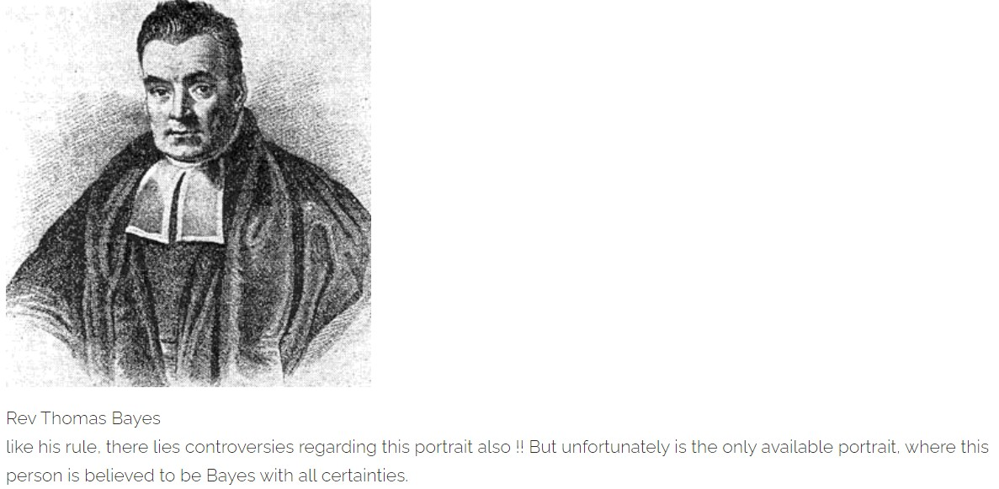
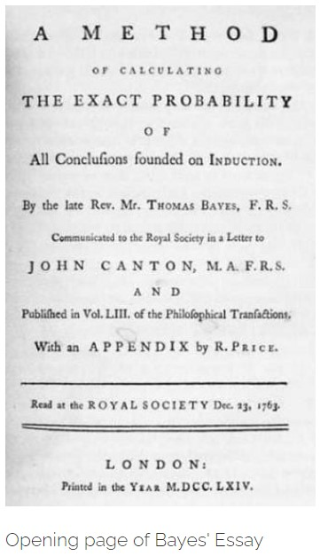
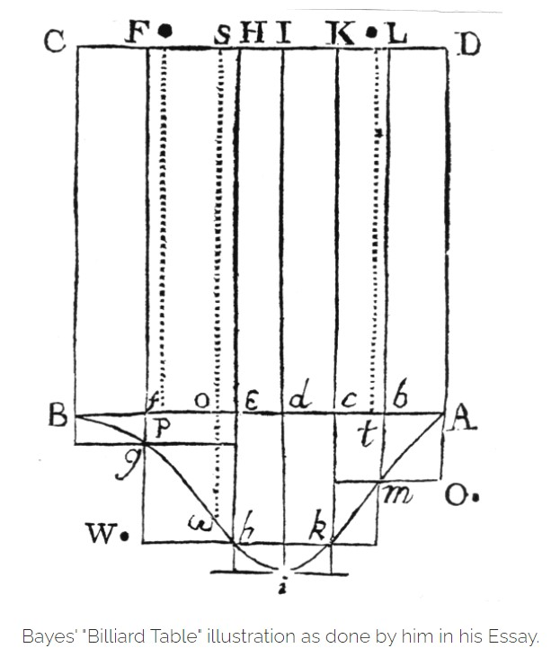

This is a post, centralized on the evolution of Bayesian Thinking and Inverse Inferences, in Probability Theory, which actually changed Statistics from a tool of Data interpretation to Causal Science.

> *"When the facts change, I change my opinion. What do you do, sir?" - John Maynard Keynes*

In the climax of our last discussion, I kept my discussion about the Jelly-bean example incomplete to begin here afresh. (If you haven't read that, you can read it before we start, here it is [Judgements in a Fitful Realm](https://probability-space.netlify.app/blog/uttaran-blog-6/). There we were actually talking about the instances, how evidences can exihibit chanciness in this uncertain world. Today we will discuss how we can update our beliefs or judgements (**Judgemental Probabilities**), based on these uncertain evidences, provided we have observed a pattern in the occurrence of this so-called circumstantial evidences.

Or in more formal literature, it is referred as Inverse-Inference, as we will first observe some outcomes and then we will go deeper investigating the plausible explanations in terms of chances, so as to have some presumed idea about future outcomes . There arises two immediate questions,

* How does it helps in predicting or foresee future?

* Why a causal explanation should depend on probabilities?

Before discussing these questions, let us discuss about the structure and some ideas behind this way of Probability Analysis. I hope with some example, the reader will able to answer the above questions themselves, and eventually appreciate this particular school of thought which inspite of lot of controversies inspired independent fields of Statistics, which made statistics one of the most important knowledge of this century. Statistics doesn't remain just a mere tool of data interpreting but, is now capable of giving causal explanations to anything and everything, from questions like whether "Smoking Causes Cancer", or " What is the chance of having a Nuclear accident?".

A century earlier, asking this sort of questions to a statistician, was outrageous, as most of the statisticians ( very likely to be egoistic), would not admit their inability in answering these sorts, would say more likely " its not answerable, due to lack of evidences", or in other words implying, "in order to find the chance of a nuclear accident, you first need to organize a planned nuclear accident !!"

### Bayes makes his glorious entry

In 1763, in an article, **"Essays towards solving a Problem in Doctrine of Chances"**, as authored by **Thomas Bayes**, he put his ideas as,

> *"Given the number of times in which an unknown event happened or failed.
Required the chance that probability of its happening in a single trial lies somewhere between any two degrees of Probability that can be named."*

It's Strange, that what Bayes stated is so coinciding with the idea of conglomerability stated by De Fenetti nearly after 200years. This is where, I feel the evolution of probability theory is so perplexing, since often quite advanced ideas emerged earlier, and then there basic explanations were put in to words afterwards. And then, there are people who put these pieces of jigsaw puzzles in places, we will come back to this works later some other day.

As Bayes' gravestone suggests, he died in 1761 at the age of 59. After 2 years of his death, his friend Richard Price, published his Essay. Price communicated the essay, together with an introduction and an appendix by himself to the Royal Society, got it published in its Philosophical Transactions in 1763. Price, while referring to Bayes' idea writes,

> *".....he says that his design at first thinks of the subject of it was, to find out a method by which we might judge concerning the probability that an event has to happen, in given circumstances, upon the supposition that we know nothing concerning it but that, under the same circumstances, it has happened a certain number of times and failed a certain other number of times."*

Basically, Bayes was talking about a machinery which would find the predictive probability that something will happen, next time, from the past information. Bayes predecessors, even including Bernoulli and de Moivre, had reasoned from chances to frequency. Bayes gave a mathematical foundation for- inference from frequencies to chances.

Even though, with advancement of his theory, Bayes' rule found many useful application from Breaking Enigma, to answering whether, Smoking causes Cancer or many other sorts, Bayes himself was not motivated to put his ideas on paper for solving a practical problem, on the contrary what motivated Bayes, was a philosophical debate which demanded mathematical argument. To, me what Bayes' idea propagates is the sole uniformity and subjectivity of nature. In one way it makes us convince that we are by virtue dependent on chances, but on the other hand it suggest with every new information, we always have a scope of improving our ideas about the uncertainty, which seemed more uncertain, before that extra bit of information. It simply tells, that it all depends on some God damn Information.

### Bayes sees the Light

An incendiary mix of religion and mathematics exploded over England in 1748, when the Scottish philosopher David Hume published an essay attacking some of fundamental narratives of organized religions. Hume believed that we can't be absolutely certain about anything that is based only on traditional beliefs, testimony, habitual relationships, or cause and effect.

As it happens, God was regarded as the First Cause of everything, Hume's skepticism about cause-and-effect relationships was especially unsettling. Hume claimed that there is always association between certain objects or event, and how they occur. Like the earlier discussion, we are likely to umbrella on a rainy day, so there is a strong association with the weather and your carrying of umbrella, but that doesn't any how implies your umbrella is the cause why it is cloudy out there, rather its the other way around. This was a pretty straight forward illustration, but as Hume illustrates more philosophically, that,

> *"....Being determined by the custom transfer the past to the future, in all our inferences; where the past has been entirely regular and uniform, we expect the event with the greatest assurance, and leave no room for any contrary supposition. But where different effects have been found to follow from causes, which are to appearance exactly similar, all these various effects must occur to the mind in transferring the past to the future, and enter into our consideration, when we determine the probability of the event. Though we give preference to that which has been found most usual, and believe that this effect will exist, we must not overlook the other effects, but must to each of them a particular weight and authority, in proportion as we have found it to be more less frequent."*

What actually, Hume tried to claim is that, you are taking umbrella that also even doesn't imply, its rainy or cloudy even, it may happen that you will use the umbrella to protect yourself from the heat, it may be less likely ( for a given person), but still not at all unworthy of neglecting it completely. And most important, the "design of the world" does not prove the existence of a creator, an ultimate cause. Because we can seldom be certain that a particular cause will have a particular effect, we must be content with finding only probable causes and probable effects.

Even though, **Hume's** essay was not mathematically sound it had profound scientific food for Bayes to think over it and develop a mathematics to quantify such probabilities. Many mathematicians and scientists used to believe that the in-explicability of the laws of the Nature, proves the existence of God, their First Cause. As **De Moivre** put it in his **"Doctrine of Chances"** , calculations about natural events would eventually reveal the underlying order of the universe and its exquisite **"Wisdom and Design"**.
The arguments, motivated Bayes, and he became keen to find ways to treat these thoughts mathematically. Sitting in that century, directly develop a probabilistic mathematics was quite difficult, as the idea of Probability was itself not very clear to the then Thinkers and Mathematicians. It was that era, when people would only understand Gambling, if you utter the word Chance. By that time, while spending his days in French Prison ( because he was a Protestant), De Moivre already had solved a gambling problem, when he worked out from cause-to-effect( like finding the chance of getting four aces in one poker hand). But still no-one ever thought of working a problem other way around, i.e. predict the causes, for an observed effect. Bayes, got in interested in questions as, what if a poker player deals himself four aces in each of the three consecutive hands ? What is the underlying chance (or cause) that his deck is loaded ?

As, Bayes himself kept his idea hidden until his fried Price, rediscovered it, it is very difficult to guess what exactly piqued Bayes' interest in the problem of inverse probability. Though he was aware of De Moivre's works, and getting interested in probability as it applied to gambling. Alternatively, it may also happen that, he was worried about the cause of Gravity, that Newton suggested, but Newton neither gave any Causal validation of Gravity , nor he talked about the truthfulness of his theory. Hence this also can be the possible reason, why he got interested in developing mathematical arguments, to predict the cause from observed effects. Finally Bayes' interest may have been stimulated by Hume's philosophical essay.

Crystallizing the essence of inverse probability problem in his mind, Bayes decided that his ai is to achieve the approximate chance of a future event, about which he knew nothing about except the pattern regarding its past occurrence. It is guessed that sometime sandwiched between 1746 and 1749, when he developed an ingenious solution. To reach the solution Bayes devised a thought experiment, which can be metaphorically referred as a 1700s version of a computer simulation. We will get to the problem, after discussing a bit about how Bayes, modified the frequency interpreting of probability.

### Bayes Modifies

At the very beginning of the essay Bayes takes the liberty to modify the general frequency interpretation, and ended up defining conditional probability, and as it happens his definition of probability were actually remarkable anticipations of the judgemental coherence views, which were developed by likes of De Fenetti and Ramsay, years after. After defining what we call mutually set of mutually exclusive and exhaustive set of events, Bayes goes forward explaining probability as,

> **"The Probability of any event is the ratio between the value at which an expectation depending on the happening of the event ought to be computed, and the value of the thing expected upon its happening."**

Like a true probabilist, Bayes defined probability from a gambling point of view, talking about payoff as an outcome of each event. But we also can treat the result itself as the payoff or expected value as a result of certain events.

As we already discussed and I tried to make the point several time, that probability of any event can be interpreted as the weighted average of the judgemental probabilities (conditional probabilities), which are obtained while observing some available evidences, and the weights of the so-defined mean are the probability of observing those evidences.

$$\mathbb{P}(A) = \mathbb{P}(A|E_1)\mathbb{P}(E_1) + \mathbb{P}(A|E_2)\mathbb{P}(E_2) + ... + \mathbb{P}(A|E_n)\mathbb{P}(E_n)$$

Here **A** is any event, which is depending on some set of **Evidences**, say \\(E = E_1, E_2, ..., E_n\\).

Though very important restriction imposed by Bayes here is that, the set of possible evidences must be mutually exclusive and form an exhaustive set, i.e., \\(E_1, E_2, ..., E_n\\) are mutually exclusive and exhaustive set.

This visualization of probability is important, once you enter the Bayesian regime. Moreover, even though frequency probability is our basic and primary understanding of probability, I find this interpretation of judgemental probabilities or sometimes also called Likelihoods( we will see later), more general model of probability, though a bit of abstraction associated, but that the true nature of an art, right ! And probability is an Art !

So, getting back to Bayes' definition of probability, mathematically speaking, If your total Judgement about an experiment (or gamble) is **N** (that is you put **N** unit on contract in case of gamble), and the there is an event **e**, then the payoff from your investment of **N**, you may expect from the occurrence of the event **e** is **N**.\\(\mathbb{P}(e)\\), or

$$\mathbb{P}(e) = \frac{\text{Expected value of out of N, if e}}{N}$$

where, \\(\mathbb{P}(e)\\) as the chance of the event **e**. He completes his definition by claiming that *"by Chance I mean Probability"*.

On basis of this definition, Bayes argues for the basic properties of probability, like additivity of disjoint probabilities in terms of additivity of expectations. But I choose not to elaborate here, as we already discussed about this in our last post and also in the post about Conglomerability. (read this article, for more elaborate discussion [`Nonconglomerability and the Law of Total Probability`](https://probability-space.netlify.app/blog/sohom-blog-7/)).

Bayes goes on to establish the definition of conditional probability. He gives a separate treatment for the case where the conditioning event precedes the conditioned one and the case where the conditioning is subsequent to the conditioned one. The latter case is a bit perplexing as it is saying like some thing already happened, now we need to travel back the time and find what might have happened (behind the scene), such that it can explain our observation. But that's what Bayes claimed to find right !! So, here Bayes give a very interesting argument in his fourth proposition, where he invites us to consider an infinite number of trials determining the occurrence of the conditioning and conditioned events,

> *"If there be two subsequent events to be determined every day, and each day the probability of the 2nd is \\(\frac{b}{N}\\) and the probability of both \\(\frac{P}{N}\\), and I am to receive N if both events happen on the first day on which the 2nd does; I say, according to these considerations, the probability of my obtaining N is \\(\frac{P}{b}\\)....."*

So, what Bayes says is on the first day either the condition happens - or if not he is facing the same wager as before :

> *"Likewise, if this coincident should not happen I have an expectation of being reinstated in my former circumstances."*

This is to say, the Probability that a event occurring, when you already observed that another event has occurred already, is just the ratio of the Expectation of the coincidence (that both the desired event and the event which occurred happened) and the Expectation of the the event that has occurred. Some time this ratio is often referred as the likelihood of the desired event, while using it in the Bayesian Probability structure.

taking the gambling realm as Bayes, the probability of win on the supposition that \\(\mathbb{E}_2\\) (the second) did not happen on the first day is just the original probability of a win. Let us assume unit stakes, so that expectation equals Probability, to simplify the exposition.

Then letting \\(\mathbb{E}_1\\) be the first event and \\(\mathbb{E}_2\\) the second , he argues as follows :

> *"Suppose after the expectation given me in foregoing proposition, and before it is all known whether the first event has happened or not, I should find that the second event has happened; from hence I can only infer that the event is determined on which my expectation depended, and have no reason to esteem the value of my expectation either greater or less than before."*

**Here with expectation, he always means the odds of that particular event, and now I explained several times how probability can actually be interpreted as expectation, so I hope readers face no difficulty (unfamiliarity may still exist) while going along with this kind of literature.**

Now, Bayes gives a money-pump argument :

> *"For if I have reason to think it less, it would be reasonable to give something to be reinstated in my former circumstances, and this over and over again as I should be informed that the second event had happened, which is evidently absurd."*

He concludes explaining the opposite scenario as,

> *And the like absurdity plainly follows if you say I ought to set a greater value on my expectation than before, for then it would be reasonable for me to refuse something if offered on the condition that I relinquish it, and be reinstated in my former circumstances...."*

These arguments by Bayes gives two basic implications that, eventhough he didn't developed the sound mathematics of the nature of the probabilities he proposed, he had the idea of coherence and by extension conglomerability, which were yet to be put into mathematical literature.

### Bayes infront of the Billiard Table, Finally!

With conditional probability in hand, Bayes proceeds to the problem with which he begins the Essay. Suppose a coin, about whose bias we know nothing at all, has been flipped **n** times and has been heads **m** times. If **x** is the chance that coin comes up heads on a single toss, Bayes requires,

$$\mathbb{P}(\text{x in [a,b] | m heads in n tosses}) = \frac{\mathbb{P}(\text{x in [a,b] and m heads in n tosses})}{\mathbb{P}(\text{m heads in n tosses})}$$

To evaluate this, Bayes must assume something about the prior probability density over the chances. Prior probability density is the basically the prior (or initial) information about the desired unknown (here it is **x**), which he first assumes, and then he went on finding the required probability, which is called the posterior probability, based on the priors he assumed and the observations he made. So, basically he keeps updating his knowledge about the desired unknown starting with a mere information about the desired unknown (**x**). But the controversy arises where, he assumes the prior probability, or he makes an assumption about the prior information, that is the overall pattern on the nature of **x**. We will come to these later, first express Bayes' final touches while completing the solution.

Now Bayes assumes a uniform prior density as the correct quantification of knowing nothing concerning it. Anticipating that this might prove controversial, as I mentioned above, and of course it has, he later offers a different justification in a **scholium**. On this basis, he applies Newton's calculus to get,

$$\frac{\int_{a}^{b}\binom{n}{m}x^{m}(1-x)^{n-m}dx}{\int_{0}^{1}\binom{n}{m}x^{m}(1-x)^{n-m}dx}$$.

How are these to be solved? Bayes evaluates integral in the denominator by a geometrical trick. This is Bayes' **"billiard table"** argument.

Suppose we throw a red ball at random on a table and mark its distance from the leftmost side. Now then we toss **n** black balls one by one on the table, as shown in the figure. Lets call a ball that falls to the right of the red ball a head and one that falls to the left a tail. This corresponds to choosing a bias at random and flipping a coin of that bias **n** times. Now nothing hangs on the first ball being the red one. We could just throw **n + 1** balls on the table and choose the one to be the red ball, the one to set bias, at random. But if we choose the leftmost ball to the red one, all is black balls count as heads and if we choose the right one to be the red ball, no black balls count as heads, and so forth. Thus the probability of **m** heads in **n** tosses is same for **m = 0, 1, ...., n**, hence the required probability must be \\(\frac{1}{n+1}\\). This is the value of the integral in the denominator. The integral in the numerator is harder and no such close form solution exists. Bayes however gives a way of approximating it too.

In scholium , Bayes uses his evaluation of the denominator to argue for his quantification of ignorance. He argues that, he knows nothing about the event except that there are **n** trials, he have no reason to think that it would succeed in some number of trials rather than another. Hence, he suggests that there is nothing wrong in taking

\\(\mathbb{P}(\text{m heads in n tosses}) = \frac{1}{n+1}\\), as our quantification of ignorance about outcomes. The uniform prior, in fact follows from this - although Bayes did not have the proof !!

### Priors to Posteriors - Journey Continues!

Once Bayes suggested a way of solving the inverse problem, of finding a bias of a coin given you observed a numbers of heads out of a number of tosses, or even extending the "billiard table" argument, suppose you are facing towards the wall and I threw the red ball and it stopped some where on the table, now you need to actually pin-point the position of the red ball, so I kept tossing each black ball (**n** times) and noting whether the black ball is landing towards the left of the red ball or the right, now using this information about the black ball with respect to the randomly placed red ball, you can actually have the idea about the portion of the table where the red ball had stopped, right ! Bayes already answered that !!

Now say if you want to be more precise about the position of the red ball, so you requested me to throw another set of **n** balls, and repeat what I was doing. But now you have extra bit of information, that is you at least know the possible portion of the red balls, from the posteriors, that Bayes calculated for you, so now you don't need to make the uniform assumption, whereas now you can you your newly acquired information, as your new prior and again update your posterior to an improved posterior probability about where on the damn table, your red ball rests.

So, this is where the genius of Bayes, takes probability to another level, using two most beautiful aspects of mathematics, that is inverse thinking and recursion.

We will get back into the next discussion, where we will be discussing about more example, the aftermath of the Bayesian introduction in the world of uncertainty, the man who did everything to give Bayesian Probability its firm footing, and obviously, **"How to calculate the probability that the sun will rise tomorrow, given it has risen everyday for 5000years !!"** .

Till then, stay safe, and keep finding the red ball on the billiard table, but don't turn around !!

### References

> *[An Essay towards Solving a Problem in the Doctrine of Chances - Thomas Bayes](`https://en.wikipedia.org/wiki/An_Essay_towards_solving_a_Problem_in_the_Doctrine_of_Chances`)*

> *The theory that would not Die- Sharon Bertsch Mcgrayne*

> *en Great Ideas About Chance- Skyrms, Diaconis*