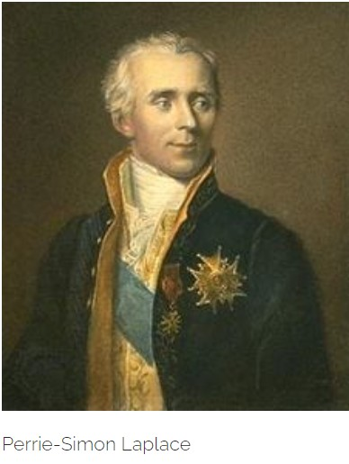
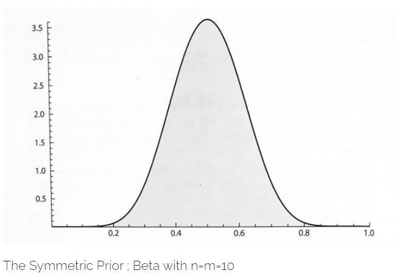
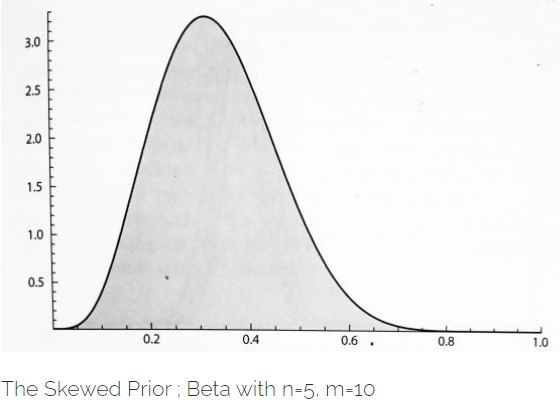
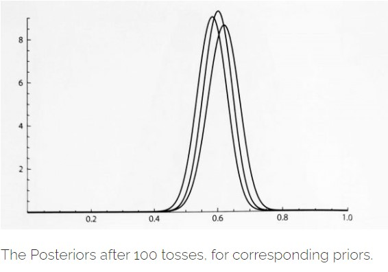

In this post, we will be discussing mainly, **Naive Bayes Theorem**, and how Laplace, developed the same idea as Bayes, independently and his law of succession go.

> *"I cannot conceal the fact here that in the specific application of these rules, I foresee many things happening which can cause one to badly mistaken if he does not proceed cautiously" - James Bernoulli*.

While watching a cricket match we often, try to predict what may happen in the next ball, and several time, we guess it correctly, I don't know much about others, but my predictions very often turns out to be true, even to the extent that, if I say, " may be Next ball will be an out-side edge caught behind by the keeper" and such thing really happens withing next 2 or 3 balls if not the immediate next ball. In college, I had a friend who could also give such precise predictions while watching a cricket match, even though he was not a student of probability. So, you see while at home or among friends, people think that we are getting lucky about our predictions.

Well, truly speaking, there's nothing wrong in that assumptions, we are indeed guessing and getting lucky. But what matters is our chance of getting lucky with our predictions is relatively higher than others !! While talking about chances, remember while making our judgements, we have no mathematical chances in our hand on which we are making predictions. What we just know is that, the proposition, we are predicting has reasonably higher probability than any other outcomes, we can think off. But how reasonable ?? Really No idea !! Actually see to take a decision regarding what may happen in the next ball, we don't need to know the mathematical probabilities, rather the need of developing probability is quite the other way around. i.e. for a judgement or proposition, you think its gonna happen or its true, we need to develop probabilistic calculation to judge how significant is my prediction.

Say, you are a manager of a cricket team(not an ordinary), and you need to pick a team for a future tournament, and you need to observe the performance in this current season, as you want to give a significant weightage on the current form of the players. So, here working with your instinctive judgements can even cost you your job. So, here you need to be sure about the relative-significance of your judgements, and take a final decision. We will come to these sort of problems, later while discussing about how decision making can be aided by Bayesian thinking. And that's where the real need of this theory lies. But as it happens, to apply first we need to our idea about the nature of these thinking quite clear. So, for now we will deal with some hypothetical but interesting problems.

### Am I really guessing?

Well, it depends what definition of guessing you are setting. Of course I was guessing, but the question is if my guesses are often correct, what is the possible explanation ?? The answer is quite simple, I'm not making judgements emotionally !! Often people realize that this may be their favorite batsman may miss a ton, but still stay emotional in predicting that !! What, parameters I always look into is the parameters where a sane probability believer will put his or her eyes on, i.e. How often, the batsman scores runs in consecutive matches, which bowler bowling and his or her ability ton swing the ball away from the batsman, in order to have an outside kiss from the bat, how often the batsman facing the ball, leaves or play balls outside off, etc etc etc. Any serious cricket lover will keep these things in account while making judgements. So, you see we are not actually guessing randomly. We are using information from every single ball. Hence, I'm always updating the chance of the propositions which I think may happen, with the information, I'm extracting after each ball is played. In precise our decision making is itself a Bayesian Robot, if and only if we are ready to give our biases !!

### Naive Bayes

We have already discussed about how the seed of inverse thinking to establish possible causal explanation was planted by Thomas Bayes,(if you haven't read our previous post, here it is [`Bayes and The Billiard Table`](https://probability-space.netlify.app/blog/uttaran-blog-8/)). The astonishing thing is that, even though Bayes' idea of evaluating inverse probability using available information was intuitive and mathematical enough, it still remained unknown or criticized if known in most of the Europe. There were mainly two reasons for that, first, may advanced thinking was not the cup of tea which the 18th century mathematicians and probability people, were ready to drink, they eventually needed the evolution of Computer to drink that cup completely, and the second reason was that, even though Bayes' idea was intuitive and radical, it needed serious mathematical support, or it would have collapsed.

So, Bayes idea was quite simple and elegant. Suppose you have a suspicion, say **S**, say the batsman will not score a ton. Then, you have a set of information say **I**, say that he or she scored a ton in the last match. So, the chance (or expectation) of your suspicion **S** to be come true, when you have observed **I** is the ratio of the chance (or expectation) that you had observed this kind of information **I**, when actually your suspicion was correct and the chance of observing what you have observed i.e. chance of observing **I**. So, mathematically,

$$\mathbb{P}(S|I) = \frac{\mathbb{P}(I|S)\mathbb{P}(S)}{\mathbb{P}(I)}$$

If we break down the \\(\mathbb{P}(I)\\), using **Total Probability (or expectation) law**, (remember !!), then we will get the form of Bayes theorem, we are accustomed to see in our textbooks,

$$\mathbb{P}(S|I) = \frac{\mathbb{P}(I|S)\mathbb{P}(S)}{\mathbb{P}(I|S)\mathbb{P}(S) + \mathbb{P}(I|S^{c})\mathbb{P}(S^{c})}$$.

Hence, here our **Prior Probability** is \\(\mathbb{P}(S)\\), i.e., chance of your suspicion to be true, gets updated to the posterior probability \\(\mathbb{P}(S|I)\\), i.e., chance of your suspicion to be true when you have observed some information supporting or doubting your suspicion. The point is you state about the truth of your prediction is changing towards the reality !

Now in the above, expression, the place where controversies arises, is what is the nature of \\(\mathbb{P}(S)\\)? that is how often, your (our), suspicion about a particular thing turns out to be true ? Here comes our hypothetical problem of Extrasensory Perception which we will ultimately converge in to the **Law of Succession**, developed by none other than the great Laplace.

### Laplace places his Thoughts

Now, suppose we are interested to know what is the chance, that my guess about the next next ball will be correct, when it is already known that some of the guesses I made earlier turned out to be correct.

Let, I, have made n guesses earlier as, \\(G_1, G_2, ..., G_n\\) which **k** guesses turned out to be correct, now if I make another guess say, \\(G_{n+1}\\), what is the chance that my current guess will turn out to be true?

Now, we will present the solution to this problem, but we will first develop the the story and intuition developed by one of the pioneer of this field. The solution turned out to be a law in future.

Thoughts are often like noises, that pops-up here and there, when in England, Bayes' hidden work got published and didn't got due attention, then in other part of Europe, the similar thoughts pops-up in the mind of young but brilliant **Pierre-Simon Laplace**. Now obviously I don't need to say more about who he is.

That was the era when Astronomy was most quantified and respected branch of science. The Science was looking forward to test Newton's Theories by explaining how precisely gravitation effects the movements of tides, interacting planets and comets, our moon, and the shape of the Earth and other planets. Years of Empirical data was collected. The Scientists and astronomers everyday went to sleep with the fear that, a single exception in their expected data could bring the entire edifice tumbling down. The question which all mattered is whether the Universe is stable !!

Astronomers, knew the planets are moving. There came a time some of them feared that slowly accelerating Jupiter will smash into the Sun someday !! The problem of predicting the motions of many interacting bodies over long periods of time is complex even today, and Newton concluded that God's miraculous intervention kept the heavens in equilibrium.

Laplace who was an Astronomer turned mathematician, took it as a challenge to explain the stability of the Universe and decided dedicating his thoughts in that. He said that while doing this Mathematics will be his telescope in hand. For a time being, he started considering ways to modify Newtons's theory of gravitation by making gravity vary with a body's velocity as well as with its mass and distance. He also wondered fleetingly whether comets might be disturbing the orbits of Jupiter and Saturn. But he changed his mind almost immediately. He realised the problem was not Newtons Theory, but the data collected by the astronomers.

Newtons's system of Gravitation, could have been verified, only if the measurements would come precise and as expected. But observational astronomy was awash with information, some of it uncertain and inadequate. That's where Laplace felt the need to introduce probability in his scientific research. This is also a very important moment for probability theory, it came out from its gambling table and got preference on the papers of a scientist. But still Laplace was far enough from the Bayesian ideas, which he was to develop in future.

In next five years Laplace wrote 13 papers in solving problems in astronomy and mathematics of celestial mechanics but still was rejected from getting membership, in French Royal Academy of Sciences. Then a time came when he actually started considered , of emigrating to Prussia to work in their academies. During this frustrated period, when he used to spent his afternoons digging in mathematical literature in libraries. And remember he was still worried about the problem with the errors in the measured astronomical data, and was beginning to think that it would require a fundamentally new way of thinking, may be probability theory to deal with the uncertainties prevading many events and their causes. That is when he began to see the light. And in that light he found the same book, which even stimulated the grey cells of Thomas Bayes, just a decade ago, he got **"The Doctrine of Chances"** by **Abraham de Moivre**. May be Laplace studied a new version of the book, unlike Bayes.

Laplace's growing interest in probability theory created a diplomatic problem, stalwarts like **D'Alembert** believed probability was too subjective for developing scientific arguments. But Laplace was young and daring to bring revolution in the thinking. He was quite sure that only probability can help him in getting precise solution while dealing with the complex problems of movements in celestial bodies. And in the process he immortalized Probability Theory while finding its application in such a higher form of scientific investigations. He began thinking, how he can find an causal explanation, behind the divergence in the error filled observations. He independently developed a thought behind developing **"Probability of Causes"** derived from the already happened events.

In is first paper on this topic, in 1773, atheist Laplace compared ignorant mankind, not with God but with an imaginary intelligence capable of knowing it all. Because humans can never know everything with certainty, probability is the mathematical expression of our ignorance : **"We owe to the frailty of the human mind one of the most delicate and ingenious of mathematical theories, namely the science of chance or probabilities"**.

He often said he did not believe in God, but neither her Biographer could decipher whether he was an atheist or a diest. But his probability of causes was a mathematical expression of the universe, and for the rest of his days he updated his theories about God and probability of causes as new evidence became available.

### Laplace's Principle of Succession

Laplace, at first dealt with the same problem as Bayes, about judging the bias of a coin, by flipping it a number of times. But, he modified a version which was quite identical to the philosophical problem, proposed by Hume, which asks the probability that the sun going to rise tomorrow when you know that sun is being rising everyday for the past **5000** years. Observe that it also very much coincides with the problem of guessing I presented at the beginning of this section.

He developed his principle, which mathematically equates as the formula we came across in the **Naive Bayes**, in fact that form of Bayes rule is more due to Laplace than due to Bayes himself !! So, using his principle, and accepting the restrictive assumption that all his possible causes or hypotheses were equally likely, he started using the Uniform prior. Laplace calculates the probability of success in the next trial (sun rising tomorrow), given there are **n** successes earlier in all **n** trials.

He, defined, a variable (which we call **Random Variable**), \\(X_i\\) which takes value of **1**, *if success comes at i th trial* or **0** *if failure*. Now, with what probability, a success will come that is unknown to us, and that what the unknown bias is, hence he took that chance say, **p** to be distributed uniformly within the interval : **(0,1)**. Let the probability density of **p**, be **f**. Now, let \\(S_n\\) be the *number of success* in **n** trials. Then,

$$S_n = X_1 + X_2 + ... + X_n$$. 

Here, 

$$S_n = n$$. 

So, we need, 

$$\mathbb{P}(X_{n+1} = 1 | X_1 = 1, X_2 = 1, ..., X_n = 1)$$

which is precisely, \\(\mathbb{P}(X_{n+1} | S_n = n)\\).

Laplace's principle was, **The probability of a cause** (*success in the next trial*) **given an event** (*past n trials all resulted in success*) **is proportional to the probability of the event, given the cause**. Which is mathematically,

$$\mathbb{P}(X_{n+1} = 1 | S_n = n) \propto \mathbb{P}(S_n = n | X_{n+1} = 1)\mathbb{P}(X_{n+1} = 1)$$

Now, see that the event of success in next trial can occur with probability **p** that we don't yet know, and wish to know. So, with \\(X_{n+1} = 1\\) we are actually claiming the chance of success is **p**, which is **uniformly distributed within (0,1)**. So, now the question is what a should be the constant of proportionality?? Laplace is witty enough to answer that the constant of proportionality is nothing but the normalizing constant of the posterior probability, \\(\mathbb{P}(X_{n+1} = 1 | S_n = n)\\)!! Since we know, conditional probabilities are also probabilities and they also follow the conglomerability and adds up to 1. Hence, in this case, the required constant is \\(\frac{1}{\mathbb{P}(S_n = n)}\\).

Now, in our statement of proportionality becomes,

$$\mathbb{P}(X_{n+1} | S_n = n) = \frac{\mathbb{P}(S_n = n | X_{n+1} - 1)\mathbb{P}(X_{n+1} = 1)}{\mathbb{P}(S_n = n)}$$

Isn't this looks like the Bayes' Rule we all know!!

Now there are two, ways the probability can be computed, I will present the elegant and more complicated way, the other you can search yourself!!

As, I was discussing that, the event \\(X_{n+1} = 1\\) is **bijective** to the event that the success chance is some **p**. So,

$$\mathbb{P}(S_n = n | X_{n+1} = 1)\mathbb{P}(X_{n+1} = 1) = \mathbb{P}(S_n = n | \text{success probability is p is uniform in 0<p<1})\mathbb{P}(X_{n+1} = 1 | \text{success probability is p is uniform in 0<p<1})$$

$$\mathbb{P}(S_n = n | X_{n+1} = 1)\mathbb{P}(X_{n+1} = 1) = \int_{0}^{1}p^{n}pdp = \frac{1}{n+2}$$

Integrated since we consider all values within the interval **(0,1)** has same density i.e., **f(p) = 1** when **0<p<1**. Now our required posterior is,

$$\mathbb{P}(X_{n+1} = 1 | S_n = n) \propto \frac{1}{n+2}$$

Now, one can verify that, our normalizing constant, \\(\mathbb{P}(S_n) = n\\) is \\(\frac{1}{n+1}\\). Use, **Law of Total Probability over 0<p<1**, using the prior density of **p**. Hence, finally, Laplace got,

$$\mathbb{P}(X_{n+1} = 1 | S_n = n) = \frac{n+1}{n+2}$$. Hence the chance of the sun rising tomorrow when it has risen, past **n** days is **n+1** out of **n+2**. 
Now, the solution to the guessing problem is also a matter of assessing the same arguments, which I leave in the hands of the reader, to find out. Another thing to note here, that Laplace, was the first called this conditional probability as likelihood, which became a quite important part of literature in Bayesian inference.

This principle, then went on to be known as the "Laplace Law of Succession". The rationale behind the nomenclature is, that with the information about the outcome of every trial, one can update the information about the chances of the success, in a successive order. Just like Thomas Bayes updated his information about the position of his read ball relative to the position of each black ball rolled on the billiard table.

Notice that for large numbers of trials an application of Laplace's rule is very close to simply taking the relative frequency of heads as ones's probability for heads the next time. In this setting, with a lot of data, naive frequentism does not go far wrong. But who, on initially getting two heads, would give probability one on heads the next time?

### Laplace Generalizes

Now, the controversy or may be in some cases, fallacy of this more rightfully called, **Bayes-Laplace Rule**, was at the uniform approximation of the priors. Suppose a flat prior is not appropriate. That is in most cases the coin may be biased, but it is unlikely to be very biased. Perhaps one might want a prior like a **symmetric bell-shaped distribution**,

The **Symmetric Prior** : **Beta Distribution** with **n = m = 10**,

Or, it may be more likely to be **biased** in one direction having a **skewed bell-shaped prior**.

Then the questions arises are, Can the simplicity and tractability of the Bayes-Laplace analysis be retained? It can. We choose an appropriate prior density proportional to the likelihood.

As, I discussed in the solution above, Laplace, wittily used the **normalizer** of the posterior probability of distribution, as the constant of proportionality, which further made the prior density to integrate to **1**.

The distribution we basically considered in the above solution could be generalized by Beta distribution, whose shapes are governed by the parameters of it that are often names as **n** and **m**. The density of beta looks like,

$$\frac{p^{n-1}(1-p)^{m-1}}{\text{normalizer}}$$ 

Here, the **Bayes-Laplace flat prior** has both **n** and **m** equals to **1**. While in the **symmetric bell-shaped prior**, which is peaked at \\(\frac{1}{2}\\), has both **n** and **m** to be equal to **10**, whereas in the second case of the **skewed prior**, the **n** is taken to **5** and **m** kept same as **10**.

Now, since the principle of Laplace states the prior density is proportional to the likelihood, pilling up frequency data keeps the updated density in the beta family. Suppose starting with parameters **n** and **m**, in a sequence of **t** trials, we incurred **s** successes. Hence, our new beta density will have parameters **n + s** and **m + (t − s)**. The resulting rule of succession gives us the probability of success for the next trial, on the evidence of **s** successes in **t** trials, as \\(\frac{s + n}{t + n + m}\\).

Clearly as claimed at the end of the last section, this ratio almost becomes the relative frequency \\(\frac{s}{t}\\), for large number of trials, which again swamps the prior. How fast this swamps the prior that depends on the magnitude of **n** and **m**.

This is here where we can actually look into not only the predictive power of this rule, but also how it updates its densities about the unknown.

### Priors Modified for Coin Tossing

Suppose, we have **62** heads in **100** tosses. The updated densities from our **uniform**, **symmetric**, and **skewed** priors doesn't show much difference. Bernoulli's inference from frequency to chance doesn't look too bad here, but now we know what assumptions we had to make to get that result.

There are limited number of shapes that can be made with beta priors. Now if one is aware of the technicalities of coin tossing, then one might want a different shape to quantify their state of prior ignorance. Persi Diaconis, a dedicated Bayesian and an experienced person regarding coin tossing, points out that coins spun on edge tend to be biased one way or another but more often towards tails. So, if an unknown coin is to be spun, Persi would prefer to put his beliefs on a **bimodal prior density** with somewhat higher peak on the tails' side, which can't be represented by beta distribution. However, we can represent such distributions, by mixtures of two beta densities, one peaked towards heads and one peaked towards tails, where the second peak is of higher altitude. Updating on frequency evidence is still relatively simple, treating the two betas as **meta hypotheses** and their weights as prior probabilities.

More generally, one has a very high rich palette of shapes available for quantifying prior states of beliefs using finite mixtures of betas. Arguably one can get anything one might find rational to represent their prior mixture of knowledge and ignorance. As before, with lot of evidence such niceties will not matter much. But if we are going to risk a lot on the next few trials, it would be prudent for us to devote some thought to putting whatever we know into our prior.

### Laplace Continues

Having his principle structured, he first applied his new, **"probability of causes"**, to solve two gambling problems when he realized that his principle need more modification. In each case he understood intuitively what should happen but got bogged down trying to prove it mathematically. First problem, we worked with an urn filled with black and white tickets in an unknown proportion ( his cause). He first drew some number of tickets from the urn and based on that experience, asked for the probability that in the next draw his ticket will be white. To, prove the answer , he fought a frustrating battle and had to write **45** equations, covering every corner of four quarto-sized pages. Today those **45** equations became redundant, or better to say reduced and compressed within of lines of simulation codes.

His second problem involved a **piquet**, a game requiring both luck and skill. Two people start playing but stop midway through the game and have to figure out how to divide the kitty by estimating their relative skill levels ( the cause). This problems, surely reminds us about the problems on which Pascal and Fermat worked, but there they both assumed that the players have equal skills. Laplace's version is more realistic.

With these two gambling problems, Laplace dealt with two very important perspective of uncertainties, first that is unknown parameter, first problem quite remarkably portrays the basic motive of Statistical Inference. And in the second problem, he dealt with even more finer perspective of uncertainty, that is Chance and Causes, which in future make this Bayes-Laplace model to be an important and comprehensive tool in drawing conclusion in the new Science of Cause and Effect.

Laplace, was then to move towards solving his actual problems in astronomy. How should they deal with different observations of the same phenomenon ? He was all set to address three of that era's biggest problems, that involved Gravitational attraction on the motions of our moon, the motions of the planets Jupiter and Saturn, and shape of the Earth. We shall keep the application of Bayesian Probabilities in these astronomical problems for some other day.

### Laplace eventually credits Bayes

Eventhough, after the surfacing and developments of the Bayesian perspective, Statistical fraternity, got divided into the two groups of Frquentists and Bayesians, ironically, both Bayes and Laplace were neutral themselves. Bayes, even in his published essay, referred his dependencies on the frequencies while get an idea about his prior assumption, and never ignited the debate neither foresee such kind of debates in future.

Similarly Laplace, in his book on Probabilities, acknowledges the relative resemblances in his principle of Probability of Causes and frequency methods, which I tried putting light on, in the previous sections. He besides from being the resurrecting Bayes' rule, also invented the Central Limit Theorem, which is more kind of an Frequencist's tool than a Bayesians'.

When Laplace started grappling with his probability of causes, and attacking problems in celestial mechanics in 1781, Richard Price arrives Paris and informed them about the discovery of Bayes'. Laplace immediately latched onto Bayes' ingenious invention, the starting guess, and incorporated it into his own, earlier version of the probability of causes. Hence, he was now confident that he was on the right track in assuming the prior causes equally likely, and assured himself about the validity of his principle. Every time he gets a new information he could use the answer from his last solution as the starting point for another calculation, That is he goes on successively. And by assuming all the prior causes equally likely, he could now formulate his principle into a law or a theorem. Though soon he was to realize about the shortcomings of his assumption of equally likely, and hence the need for generalizing, which we already talked about a bit under the section **Laplace Generalizes**.

Laplace later credited Bayes with being first when he wrote,

> *"The theory whose principles I explained some years after,.... he accomplished in an acute and very ingenious, though slightly awkward, manner."*

Although Bayes originated the probability of causes, Laplace discovered the same on his own. When, Bayes' Essay eas published by his friend Price, Laplace was only 15. The approach and the principle both Bayes and Laplace developed are independent mathematically speaking. We will be discussing in more details the mathematical perspectives of both Laplace and Bayes in our coming articles.

Till then, stay safe, and keep finding the solutions for the Gambling Problems Laplace worked on, they no more need 45 equations to be solved nowadays!!

### References

> *Probability Theory- the logic of science - E.T.Jaynes*

> *A Philosophical Essay on Probabilities - Peirre-Simon Laplace*

> *The theory that would not Die- Sharon Bertsch Mcgrayne*

> *Ten Great Ideas About Chance- Skyrms, Diaconis*

