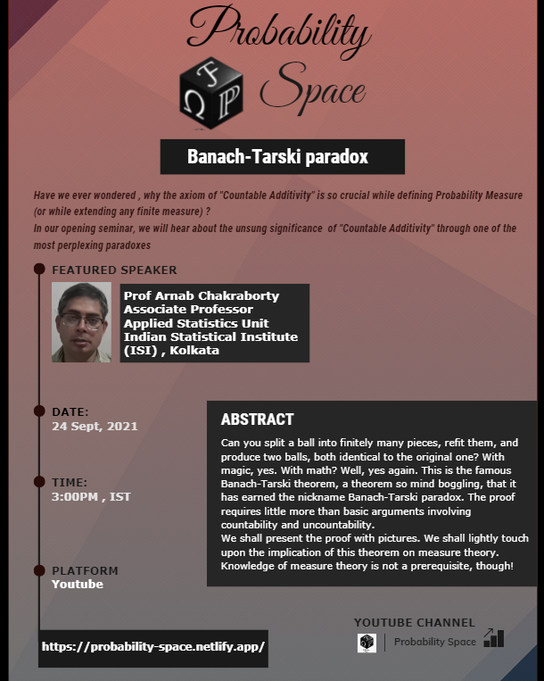

This is our first webinar, where Prof. Arnab Chakraborty of Indian Statistical Institute, Kolkata will be speaking on '*The Banach Tarski Paradox*'.

Have we ever wondered, why the axiom of "**Countable Additivity**" is so crucial while defining Probability Measure (or while extending any finite measure)?

In our opening webinar, we will hear about the usung significance of Countable Additivity through one of the most perplexing paradoxes.

So we invite all of you to attend this session, being live steamed on YouTube, the link to which is provided below.

### Abstract

Can you split a ball into finitely many pieces, refit them, and produce two balls, both identical to the original one? With magic, yes. With math? Well, yes again. This is the famous **Banach-Tarski theorem**, a theorem so mind-boggling, that it has earned the nickname **Banach-Tarski Paradox**. The proof requires more than basic arguments involving *countability* and *uncountability*.

We shall present the proof with pictures. We shall lightly touch upon the implication of this theorem on measure theory. *Knowledge of measure theory is not a pre-requisite, though!*

### Event Details

> Date: 24th Septmber, 2021

> Time: 3:00 PM (IST)

> Platform: [<i class="fab fa-youtube"></i> Yotube](https://www.youtube.com/channel/UCBxZanUU8pJ78PhZx22ufdQ) 

---

We encourage discussions and queries related to the topic of the above webinar as discussed by Prof. Chakraborty, through this *Disqus* thread below. Feel free to share and interact! 

---

<noscript>Please enable JavaScript to view the <a href="https://disqus.com/?ref_noscript">comments powered by Disqus.</a></noscript>
